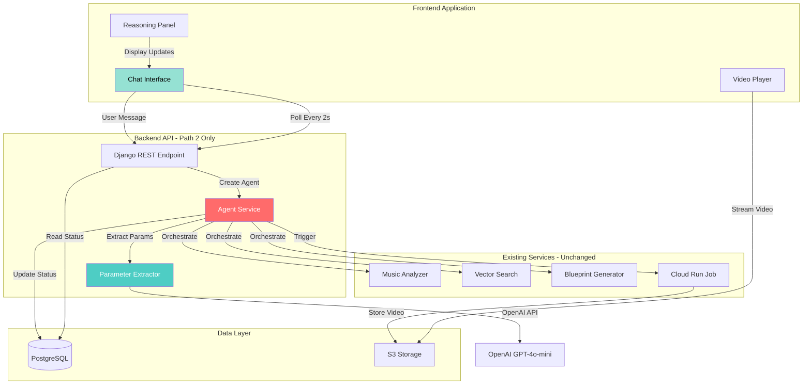
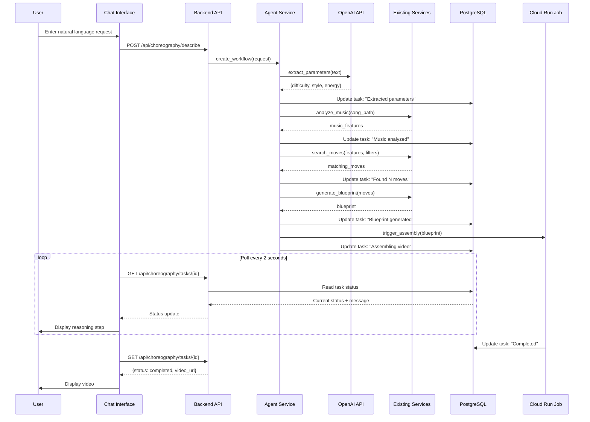

# Design Document: Agent Orchestration & Conversational Interface

## Overview

This design document specifies the implementation of autonomous agent orchestration and conversational interface for Path 2 ("Describe Choreography") in the Bachata Buddy application. The system will use **OpenAI function calling** for agent orchestration and OpenAI GPT-4o-mini for natural language understanding, transforming the choreography generation workflow into an intelligent, conversational experience.

**Key Design Principles:**
- Reuse existing infrastructure (HTTP polling, database fields, services)
- Minimize complexity by avoiding WebSockets and complex state management
- Preserve Path 1 completely unchanged
- Build on proven patterns from the Gradio MCP demo
- Use OpenAI function calling for intelligent workflow orchestration

**Important: Architecture Clarification:**
- **OpenAI Function Calling**: The Agent Service uses OpenAI's function calling feature to orchestrate the workflow
- **LLM-Driven Orchestration**: OpenAI GPT-4o-mini decides which functions to call and in what order based on the user's request
- **Tool Definitions**: Python functions (analyze_music, search_moves, generate_blueprint, assemble_video) are exposed as tools to OpenAI
- **No MCP Servers**: Do NOT implement MCP servers within the project code - MCP is only used in Kiro IDE for development
- **Stateful Conversation**: The agent maintains conversation state across multiple function calls until the workflow completes

**Development Standards:**
- **Python Package Management**: All Python dependencies MUST be managed using `pyproject.toml` with UV as the package manager
- **Python Execution**: All Python commands MUST be executed using `uv run` (e.g., `uv run python script.py`, `uv run pytest`)
- **Agent Development**: The Agent Service MUST use OpenAI function calling for orchestrating service calls and managing workflow state
- **Function/Tool Definitions**: All service functions MUST be defined with proper schemas for OpenAI function calling
- **No MCP Servers**: Do NOT implement MCP servers within the project - MCP is only used in Kiro IDE for development
- **No pip/virtualenv**: Direct use of `pip` or manual `virtualenv` management is prohibited - UV handles all environment and dependency management

## Architecture

### High-Level Architecture



### Component Interaction Flow



## Development Tools and Standards

### Python Package Management

**UV Package Manager:**
All Python development MUST use UV for package and environment management:

```bash
# Install dependencies
uv sync

# Run Python scripts
uv run python script.py

# Run Django commands
uv run python manage.py migrate
uv run python manage.py runserver

# Run tests
uv run pytest

# Add new dependencies
uv add strands-sdk
uv add openai
```

**pyproject.toml Configuration:**

All Python dependencies MUST be declared in `pyproject.toml`:

```toml
[project]
name = "bachata-buddy-backend"
version = "1.0.0"
requires-python = ">=3.12"
dependencies = [
    "django>=5.2",
    "djangorestframework>=3.14",
    "strands-sdk>=1.0.0",
    "openai>=1.0.0",
    "psycopg2-binary>=2.9",
    "gunicorn>=21.0",
    # ... existing dependencies
]

[project.optional-dependencies]
dev = [
    "pytest>=7.0",
    "pytest-django>=4.5",
    "black>=23.0",
    "ruff>=0.1",
]

[tool.uv]
dev-dependencies = [
    "pytest>=7.0",
    "pytest-django>=4.5",
]
```

**Prohibited Practices:**
- ❌ Using `pip install` directly
- ❌ Using `virtualenv` or `venv` manually
- ❌ Using `requirements.txt` for dependency management
- ✅ Always use `uv add` for new dependencies
- ✅ Always use `uv run` for executing Python commands
- ✅ Always use `pyproject.toml` for dependency specification

### OpenAI Function Calling Integration

**Agent Service Architecture:**

The Agent Service MUST use OpenAI function calling to orchestrate service calls:

```python
from openai import OpenAI

# Define tools/functions for OpenAI
tools = [
    {
        "type": "function",
        "function": {
            "name": "analyze_music",
            "description": "Analyze music features from the selected song",
            "parameters": {
                "type": "object",
                "properties": {
                    "song_path": {"type": "string", "description": "Path to the audio file"}
                },
                "required": ["song_path"]
            }
        }
    },
    {
        "type": "function",
        "function": {
            "name": "search_moves",
            "description": "Search for dance moves matching the music and parameters",
            "parameters": {
                "type": "object",
                "properties": {
                    "music_features": {"type": "object", "description": "Music analysis results"},
                    "difficulty": {"type": "string", "enum": ["beginner", "intermediate", "advanced"]},
                    "style": {"type": "string", "enum": ["traditional", "modern", "romantic", "sensual"]}
                },
                "required": ["music_features", "difficulty", "style"]
            }
        }
    },
    {
        "type": "function",
        "function": {
            "name": "generate_blueprint",
            "description": "Generate choreography blueprint from selected moves",
            "parameters": {
                "type": "object",
                "properties": {
                    "moves": {"type": "array", "description": "List of selected dance moves"},
                    "music_features": {"type": "object", "description": "Music analysis results"}
                },
                "required": ["moves", "music_features"]
            }
        }
    },
    {
        "type": "function",
        "function": {
            "name": "assemble_video",
            "description": "Trigger video assembly job with the blueprint",
            "parameters": {
                "type": "object",
                "properties": {
                    "blueprint": {"type": "object", "description": "Choreography blueprint"}
                },
                "required": ["blueprint"]
            }
        }
    }
]

# Agent orchestration loop
client = OpenAI(api_key=settings.OPENAI_API_KEY)
messages = [{"role": "user", "content": user_request}]

while True:
    response = client.chat.completions.create(
        model="gpt-4o-mini",
        messages=messages,
        tools=tools,
        tool_choice="auto"
    )
    
    # Check if OpenAI wants to call a function
    if response.choices[0].finish_reason == "tool_calls":
        for tool_call in response.choices[0].message.tool_calls:
            # Execute the requested function
            function_result = self._execute_function(
                tool_call.function.name,
                json.loads(tool_call.function.arguments)
            )
            
            # Add function result to conversation
            messages.append({
                "role": "function",
                "name": tool_call.function.name,
                "content": json.dumps(function_result)
            })
    else:
        # Workflow complete
        break
```

**Service Integration:**

Services are called when OpenAI requests function execution:

```python
def _execute_function(self, function_name: str, arguments: dict) -> dict:
    """Execute a function requested by OpenAI."""
    if function_name == "analyze_music":
        music_features = self.music_analyzer.analyze_audio(arguments['song_path'])
        self._update_task_status(self.task_id, "Music analyzed", "analyze_music", 25)
        return {"music_features": music_features}
    
    elif function_name == "search_moves":
        moves = self.vector_search.search(
            arguments['music_features'],
            difficulty=arguments['difficulty'],
            style=arguments['style']
        )
        self._update_task_status(self.task_id, f"Found {len(moves)} moves", "search_moves", 50)
        return {"moves": moves}
    
    # ... other functions
```

**Benefits of OpenAI Function Calling:**
- LLM-driven intelligent orchestration
- Adaptive workflow based on user request
- Natural language understanding of requirements
- Built-in error handling and retry logic
- Conversational interaction with reasoning
- Flexible function sequencing

## Components and Interfaces

### 1. Agent Service

**Location:** `bachata_buddy/backend/services/agent_service.py`

**Purpose:** Orchestrates choreography generation using OpenAI function calling

**Key Classes:**

```python
class AgentService:
    """
    Orchestrates choreography generation using OpenAI function calling.
    """
    
    def __init__(
        self,
        openai_api_key: str,
        parameter_extractor: ParameterExtractor,
        music_analyzer: MusicAnalyzer,
        vector_search: VectorSearchService,
        blueprint_generator: BlueprintGenerator,
        jobs_service: CloudRunJobsService
    ):
        """Initialize with OpenAI client and service dependencies."""
        self.client = OpenAI(api_key=openai_api_key)
        self.parameter_extractor = parameter_extractor
        self.music_analyzer = music_analyzer
        self.vector_search = vector_search
        self.blueprint_generator = blueprint_generator
        self.jobs_service = jobs_service
    
    def create_workflow(
        self,
        task_id: str,
        user_request: str,
        user_id: int
    ) -> ChoreographyTask:
        """
        Create and execute OpenAI function calling workflow for choreography generation.
        
        Returns:
            ChoreographyTask with initial status
        """
        pass
    
    def _define_tools(self) -> List[Dict]:
        """Define function/tool schemas for OpenAI."""
        pass
    
    def _execute_function(self, function_name: str, arguments: Dict) -> Dict:
        """Execute a function requested by OpenAI."""
        pass
    
    def _analyze_music(self, song_path: str) -> Dict:
        """Tool: Analyze music features."""
        pass
    
    def _search_moves(self, music_features: Dict, difficulty: str, style: str) -> Dict:
        """Tool: Search for matching moves."""
        pass
    
    def _generate_blueprint(self, moves: List[Dict], music_features: Dict) -> Dict:
        """Tool: Generate choreography blueprint."""
        pass
    
    def _assemble_video(self, blueprint: Dict) -> Dict:
        """Tool: Trigger video assembly job."""
        pass
    
    def _update_task_status(
        self,
        task_id: str,
        message: str,
        stage: str,
        progress: int
    ):
        """Update task status in database."""
        pass
```

**OpenAI Function Calling Integration:**

The Agent Service will use OpenAI function calling to create an intelligent, adaptive workflow:

```python
from openai import OpenAI

def create_workflow(self, task_id: str, user_request: str, user_id: int):
    """Execute OpenAI function calling workflow."""
    self.task_id = task_id
    
    # Define available tools
    tools = self._define_tools()
    
    # Initialize conversation
    messages = [
        {
            "role": "system",
            "content": "You are a choreography generation assistant. Use the available tools to create a bachata choreography based on the user's request."
        },
        {
            "role": "user",
            "content": user_request
        }
    ]
    
    # Orchestration loop
    while True:
        response = self.client.chat.completions.create(
            model="gpt-4o-mini",
            messages=messages,
            tools=tools,
            tool_choice="auto"
        )
        
        message = response.choices[0].message
        messages.append(message)
        
        # Check if OpenAI wants to call functions
        if message.tool_calls:
            for tool_call in message.tool_calls:
                # Execute requested function
                function_result = self._execute_function(
                    tool_call.function.name,
                    json.loads(tool_call.function.arguments)
                )
                
                # Add result to conversation
                messages.append({
                    "role": "tool",
                    "tool_call_id": tool_call.id,
                    "content": json.dumps(function_result)
                })
        else:
            # Workflow complete
            break
    
    return ChoreographyTask.objects.get(task_id=task_id)
```

### 2. Parameter Extractor

**Location:** `bachata_buddy/backend/services/parameter_extractor.py`

**Purpose:** Extracts structured parameters from natural language using OpenAI

**Key Classes:**

```python
class ParameterExtractor:
    """
    Extracts choreography parameters from natural language.
    """
    
    def __init__(self, openai_api_key: str):
        """Initialize with OpenAI API key."""
        self.client = OpenAI(api_key=openai_api_key)
    
    def extract_parameters(
        self,
        user_text: str
    ) -> Dict[str, Any]:
        """
        Extract parameters from user text using OpenAI GPT-4o-mini.
        
        Args:
            user_text: Natural language choreography request
        
        Returns:
            Dictionary with difficulty, energy_level, style, duration
        
        Raises:
            ParameterExtractionError: If extraction fails
        """
        pass
    
    def _create_extraction_prompt(self, user_text: str) -> str:
        """Create prompt for OpenAI parameter extraction."""
        pass
    
    def _validate_parameters(self, params: Dict) -> Dict:
        """Validate and normalize extracted parameters."""
        pass
    
    def _fallback_keyword_extraction(self, user_text: str) -> Dict:
        """Fallback keyword-based extraction if OpenAI fails."""
        pass
```

**Extraction Prompt Template:**

```python
EXTRACTION_PROMPT = """You are a choreography assistant. Extract parameters from this request.

User request: "{user_text}"

Extract these parameters (use defaults if not specified):
- difficulty: beginner, intermediate, or advanced (default: beginner)
- energy_level: low, medium, or high (default: medium)
- style: traditional, modern, romantic, or sensual (default: modern)
- duration: approximate duration in seconds (default: 60)

Respond ONLY with JSON:
{{"difficulty": "...", "energy_level": "...", "style": "...", "duration": ...}}"""
```

### 3. Chat Interface (Frontend)

**Location:** `bachata_buddy/frontend/src/pages/DescribeChoreo.jsx`

**Purpose:** Conversational UI for Path 2

**Key Components:**

```jsx
function DescribeChoreo() {
  const [messages, setMessages] = useState([]);
  const [input, setInput] = useState('');
  const [taskId, setTaskId] = useState(null);
  const [isGenerating, setIsGenerating] = useState(false);
  
  // Poll for status updates every 2 seconds
  usePolling(
    () => api.tasks.getStatus(taskId),
    2000,
    taskId && isGenerating
  );
  
  const handleSubmit = async () => {
    // Send message to backend
    const response = await api.choreography.describe({
      user_request: input
    });
    
    setTaskId(response.task_id);
    setIsGenerating(true);
    
    // Add user message to chat
    setMessages([...messages, {
      role: 'user',
      content: input
    }]);
  };
  
  return (
    <Container>
      <ChatMessages messages={messages} />
      <ReasoningPanel taskId={taskId} />
      <ChatInput 
        value={input}
        onChange={setInput}
        onSubmit={handleSubmit}
        disabled={isGenerating}
      />
    </Container>
  );
}
```

### 4. Reasoning Panel (Frontend)

**Location:** `bachata_buddy/frontend/src/components/agent/ReasoningPanel.jsx`

**Purpose:** Displays agent reasoning steps in real-time

**Key Components:**

```jsx
function ReasoningPanel({ taskId }) {
  const { data: task } = usePolling(
    () => api.tasks.getStatus(taskId),
    2000,
    taskId
  );
  
  return (
    <div className="reasoning-panel">
      <h3>Agent Reasoning</h3>
      <div className="steps">
        {task?.message && (
          <ReasoningStep
            icon={getStepIcon(task.stage)}
            message={task.message}
            progress={task.progress}
          />
        )}
      </div>
    </div>
  );
}
```

### 5. Backend API Endpoints

**New Endpoint:** `POST /api/choreography/describe`

```python
@api_view(['POST'])
@permission_classes([IsAuthenticated])
def describe_choreography(request):
    """
    Generate choreography from natural language description.
    
    Request body:
        {
            "user_request": "Create a romantic bachata for beginners"
        }
    
    Response:
        {
            "task_id": "uuid",
            "status": "started",
            "message": "Analyzing your request...",
            "poll_url": "/api/choreography/tasks/{task_id}"
        }
    """
    serializer = DescribeChoreographySerializer(data=request.data)
    if not serializer.is_valid():
        return Response(serializer.errors, status=400)
    
    user_request = serializer.validated_data['user_request']
    
    # Create task
    task_id = str(uuid.uuid4())
    task = ChoreographyTask.objects.create(
        task_id=task_id,
        user=request.user,
        status='pending',
        progress=0,
        stage='parsing_request',
        message='Analyzing your request...'
    )
    
    # Initialize agent service
    agent_service = get_agent_service()
    
    # Execute workflow asynchronously
    try:
        agent_service.create_workflow(
            task_id=task_id,
            user_request=user_request,
            user_id=request.user.id
        )
    except Exception as e:
        task.status = 'failed'
        task.error = str(e)
        task.save()
        return Response(
            {'error': 'Failed to start agent workflow'},
            status=500
        )
    
    return Response({
        'task_id': task_id,
        'status': 'started',
        'message': task.message,
        'poll_url': f'/api/choreography/tasks/{task_id}'
    }, status=202)
```

**Modified Endpoint:** `GET /api/choreography/tasks/{task_id}`

No changes needed - existing endpoint already returns all required fields (status, progress, stage, message, result, error).

## Data Models

### Existing ChoreographyTask Model (No Changes)

The existing model already has all fields we need:

```python
class ChoreographyTask(models.Model):
    task_id = models.UUIDField(primary_key=True)
    user = models.ForeignKey(User, on_delete=models.CASCADE)
    status = models.CharField(max_length=20)  # pending, started, running, completed, failed
    progress = models.IntegerField(default=0)  # 0-100
    stage = models.CharField(max_length=50)  # Current stage name
    message = models.TextField()  # Current status message (agent reasoning)
    result = models.JSONField(null=True)  # Final result with video_url
    error = models.TextField(null=True)  # Error message if failed
    created_at = models.DateTimeField(auto_now_add=True)
    updated_at = models.DateTimeField(auto_now=True)
```

**How Agent Uses These Fields:**

- `stage`: Stores current workflow step name ("extracting_parameters", "analyzing_music", "searching_moves", "generating_blueprint", "assembling_video")
- `message`: Stores human-readable reasoning message ("Extracted parameters: beginner, romantic, medium energy")
- `progress`: Updated at each step (0 → 20 → 40 → 60 → 80 → 100)
- `result`: Stores final summary and video_url when complete

### Agent State (In-Memory Only)

```python
class AgentState(TypedDict):
    """
    Agent workflow state (not persisted to database).
    """
    task_id: str
    user_id: int
    user_request: str
    parameters: Dict[str, Any]  # Extracted parameters
    music_features: Optional[Dict]  # From music analyzer
    matching_moves: Optional[List[Dict]]  # From vector search
    blueprint: Optional[Dict]  # From blueprint generator
    video_url: Optional[str]  # From job service
    current_step: str  # Current workflow step
    error: Optional[str]  # Error if any
```

This state exists only during workflow execution and is not stored in the database.

## Error Handling

### Error Categories

1. **Parameter Extraction Errors**
   - OpenAI API failure → Fallback to keyword extraction
   - Invalid parameters → Apply defaults and continue
   - Missing API key → Fail fast at startup

2. **Service Errors**
   - Music analysis failure → Store error in task.error, mark as failed
   - Vector search failure → Store error in task.error, mark as failed
   - Blueprint generation failure → Store error in task.error, mark as failed
   - Job submission failure → Store error in task.error, mark as failed

3. **Workflow Errors**
   - Step execution failure → Catch exception, update task with error, stop workflow
   - Timeout → Not implemented (rely on existing job timeout)

### Error Handling Strategy

```python
def _execute_workflow_step(self, step_name: str, step_func, state: Dict) -> Dict:
    """
    Execute a workflow step with error handling.
    """
    try:
        # Update task status
        self._update_task_status(
            task_id=state['task_id'],
            message=f"Executing {step_name}...",
            stage=step_name,
            progress=self._calculate_progress(step_name)
        )
        
        # Execute step
        result = step_func(state)
        
        # Update task with success message
        self._update_task_status(
            task_id=state['task_id'],
            message=result.get('message', f"{step_name} completed"),
            stage=step_name,
            progress=self._calculate_progress(step_name)
        )
        
        return result
        
    except Exception as e:
        # Log error
        logger.error(f"Step {step_name} failed: {e}", exc_info=True)
        
        # Update task with error
        task = ChoreographyTask.objects.get(task_id=state['task_id'])
        task.status = 'failed'
        task.error = f"{step_name} failed: {str(e)}"
        task.message = f"Error in {step_name}"
        task.save()
        
        # Re-raise to stop workflow
        raise
```

## Testing Strategy

### Unit Tests

**Test Coverage:**
- Parameter extraction with various inputs
- Keyword fallback extraction
- Agent workflow step execution
- Error handling in each step
- Task status updates

**Example Tests:**

```python
class TestParameterExtractor(TestCase):
    def test_extract_beginner_romantic(self):
        """Test extraction of beginner romantic request."""
        extractor = ParameterExtractor(api_key="test")
        result = extractor.extract_parameters(
            "Create a romantic bachata for beginners"
        )
        self.assertEqual(result['difficulty'], 'beginner')
        self.assertEqual(result['style'], 'romantic')
    
    def test_fallback_keyword_extraction(self):
        """Test keyword fallback when OpenAI fails."""
        extractor = ParameterExtractor(api_key="invalid")
        result = extractor._fallback_keyword_extraction(
            "advanced energetic choreography"
        )
        self.assertEqual(result['difficulty'], 'advanced')
        self.assertEqual(result['style'], 'energetic')

class TestAgentService(TestCase):
    def test_workflow_execution(self):
        """Test complete workflow execution."""
        agent = AgentService(...)
        task = agent.create_workflow(
            task_id="test-123",
            user_request="beginner romantic",
            user_id=1
        )
        self.assertEqual(task.status, 'started')
    
    def test_error_handling(self):
        """Test error handling in workflow."""
        # Mock service to raise error
        agent = AgentService(...)
        with self.assertRaises(WorkflowError):
            agent.create_workflow(...)
```

### Integration Tests

**Test Scenarios:**
- End-to-end workflow with real services
- API endpoint with agent orchestration
- Frontend polling and status display
- Error recovery and user feedback

**Example Tests:**

```python
class TestAgentIntegration(TestCase):
    def test_end_to_end_workflow(self):
        """Test complete agent workflow."""
        # Create request
        response = self.client.post('/api/choreography/describe', {
            'user_request': 'romantic bachata for beginners'
        })
        self.assertEqual(response.status_code, 202)
        
        task_id = response.data['task_id']
        
        # Poll until complete
        for _ in range(60):  # 2 minutes max
            task_response = self.client.get(
                f'/api/choreography/tasks/{task_id}'
            )
            if task_response.data['status'] == 'completed':
                break
            time.sleep(2)
        
        # Verify completion
        self.assertEqual(task_response.data['status'], 'completed')
        self.assertIsNotNone(task_response.data['result']['video_url'])
```


## Correctness Properties

*A property is a characteristic or behavior that should hold true across all valid executions of a system-essentially, a formal statement about what the system should do. Properties serve as the bridge between human-readable specifications and machine-verifiable correctness guarantees.*

### Property 1: Parameter extraction completeness
*For any* natural language choreography request, the Parameter Extractor should return a dictionary containing all required parameter keys (difficulty, energy_level, style, duration) with valid values from the allowed option lists
**Validates: Requirements 1.1, 1.4**

### Property 2: Default parameter application
*For any* incomplete or ambiguous choreography request, the Parameter Extractor should apply default values for missing parameters, ensuring the returned dictionary is always complete and valid
**Validates: Requirements 1.2**

### Property 3: Workflow step completeness
*For any* agent workflow instance, the execution plan should contain all required step names in the correct sequence: extract_parameters, analyze_music, search_moves, generate_blueprint, assemble_video
**Validates: Requirements 2.2**

### Property 4: Workflow data flow
*For any* workflow execution, each step should receive the outputs from the previous step as inputs, maintaining data continuity throughout the workflow
**Validates: Requirements 2.4**

### Property 5: Parameter validation
*For any* parameter dictionary (whether from OpenAI or keyword extraction), the Parameter Extractor should validate that difficulty is in [beginner, intermediate, advanced], energy_level is in [low, medium, high], and style is in [traditional, modern, romantic, sensual]
**Validates: Requirements 7.3**

### Property 6: Task status updates
*For any* workflow step execution, the Backend API should update the Choreography Task record with the current step name in the stage field, a descriptive message in the message field, and an appropriate progress percentage
**Validates: Requirements 3.2, 8.1, 8.4, 9.1, 9.2**

### Property 7: Workflow state persistence
*For any* Strands SDK workflow execution, the Agent Service should maintain state data across all nodes, ensuring that data added in one step is available to subsequent steps
**Validates: Requirements 6.3**

### Property 8: Path 1 agent bypass
*For any* choreography request submitted via Path 1 (song selection), the Backend API should process the request without invoking the Agent Service
**Validates: Requirements 5.2, 5.3**

## Development Tools & Dependency Management

### UV Package Manager

**Requirement:** All Python development for this feature MUST use UV for package management.

**Why UV:**
- 10-100x faster than pip for dependency resolution
- Built-in virtual environment management
- Better reproducibility with lockfiles
- Modern Python tooling (PEP 621 compliant)
- Seamless integration with pyproject.toml

**Installation:**
```bash
# Install UV (one-time setup)
curl -LsSf https://astral.sh/uv/install.sh | sh

# Or via pip
pip install uv
```

**Usage:**
```bash
# Create virtual environment
uv venv

# Activate virtual environment
source .venv/bin/activate  # Linux/Mac
.venv\Scripts\activate     # Windows

# Install dependencies from pyproject.toml
uv pip install -e .

# Add new dependency
uv pip install strands-sdk
# Then manually add to pyproject.toml

# Sync dependencies
uv pip sync
```

### pyproject.toml

**Requirement:** All Python dependencies MUST be declared in pyproject.toml (no requirements.txt).

**Example pyproject.toml for Backend:**
```toml
[project]
name = "bachata-buddy-backend"
version = "1.0.0"
description = "Bachata Buddy Backend API with Agent Orchestration"
requires-python = ">=3.12"
dependencies = [
    "django>=5.2.0",
    "djangorestframework>=3.14.0",
    "psycopg2-binary>=2.9.0",
    "gunicorn>=21.0.0",
    "openai>=1.0.0",  # Required for function calling and parameter extraction
    "librosa>=0.10.0",
    "sentence-transformers>=2.2.0",
    "faiss-cpu>=1.7.0",
    "boto3>=1.28.0",
    "python-dotenv>=1.0.0",
]

[project.optional-dependencies]
dev = [
    "pytest>=7.4.0",
    "pytest-django>=4.5.0",
    "pytest-cov>=4.1.0",
    "black>=23.0.0",
    "ruff>=0.1.0",
]

[build-system]
requires = ["setuptools>=68.0.0", "wheel"]
build-backend = "setuptools.build_meta"

[tool.pytest.ini_options]
DJANGO_SETTINGS_MODULE = "config.settings"
python_files = ["test_*.py", "*_test.py"]
testpaths = ["tests"]

[tool.black]
line-length = 100
target-version = ['py312']

[tool.ruff]
line-length = 100
target-version = "py312"
```

**Benefits:**
- Single source of truth for dependencies
- PEP 621 standard compliance
- Better tooling support (UV, pip, poetry all support it)
- Cleaner project structure
- Easier dependency management

**Migration from requirements.txt:**
```bash
# If you have existing requirements.txt
# Convert to pyproject.toml format manually
# Then remove requirements.txt

# Install from new pyproject.toml
uv pip install -e .
```

## Configuration

### Environment Variables

```python
# OpenAI Configuration
OPENAI_API_KEY=sk-...  # Required for parameter extraction

# Agent Configuration
AGENT_ENABLED=true  # Enable/disable agent orchestration
AGENT_TIMEOUT=300  # Workflow timeout in seconds (default: 5 minutes)

# Existing Configuration (unchanged)
DATABASE_URL=postgresql://...
AWS_ACCESS_KEY_ID=...
AWS_SECRET_ACCESS_KEY=...
CLOUD_RUN_JOB_NAME=...
```

### Service Initialization

```python
# backend/services/__init__.py

def get_agent_service():
    """
    Get or create Agent Service singleton.
    """
    if not hasattr(get_agent_service, '_instance'):
        # Initialize dependencies
        parameter_extractor = ParameterExtractor(
            openai_api_key=settings.OPENAI_API_KEY
        )
        
        music_analyzer = MusicAnalyzer()
        vector_search = get_vector_search_service()
        blueprint_generator = BlueprintGenerator(
            vector_search_service=vector_search,
            music_analyzer=music_analyzer
        )
        jobs_service = CloudRunJobsService()
        
        # Create agent service
        get_agent_service._instance = AgentService(
            parameter_extractor=parameter_extractor,
            music_analyzer=music_analyzer,
            vector_search=vector_search,
            blueprint_generator=blueprint_generator,
            jobs_service=jobs_service
        )
    
    return get_agent_service._instance
```

## Deployment Considerations

### Backward Compatibility

- Path 1 endpoints remain completely unchanged
- Existing tests continue to pass without modification
- Database schema requires no changes
- Frontend Path 1 pages remain unchanged

### Feature Flag

The agent orchestration can be enabled/disabled via environment variable:

```python
# settings.py
AGENT_ENABLED = os.getenv('AGENT_ENABLED', 'true').lower() == 'true'

# views.py
@api_view(['POST'])
def describe_choreography(request):
    if not settings.AGENT_ENABLED:
        return Response(
            {'error': 'Agent orchestration is disabled'},
            status=503
        )
    # ... rest of implementation
```

### Performance Considerations

**Parameter Extraction:**
- OpenAI GPT-4o-mini: ~500ms average latency
- Keyword fallback: <10ms
- Total: <2 seconds (meets requirement)

**Workflow Execution:**
- Parameter extraction: ~500ms
- Music analysis: ~2-3 seconds (existing)
- Vector search: ~100ms (existing)
- Blueprint generation: ~500ms (existing)
- Job submission: ~200ms (existing)
- Total: ~4-5 seconds before video assembly starts

**Database Updates:**
- Each workflow step updates task record: ~10ms per update
- 5 steps = ~50ms total overhead
- Negligible impact on overall performance

### Monitoring

**Key Metrics to Track:**
- Parameter extraction success rate
- Parameter extraction latency (p50, p95, p99)
- Workflow completion rate
- Workflow step failure rates
- OpenAI API error rate
- Keyword fallback usage rate

**CloudWatch Logs:**
```python
logger.info(
    "Agent workflow started",
    extra={
        'task_id': task_id,
        'user_id': user_id,
        'user_request': user_request
    }
)

logger.info(
    "Parameter extraction completed",
    extra={
        'task_id': task_id,
        'method': 'openai',  # or 'keyword'
        'latency_ms': latency,
        'parameters': parameters
    }
)

logger.error(
    "Workflow step failed",
    extra={
        'task_id': task_id,
        'step': step_name,
        'error': str(error)
    },
    exc_info=True
)
```

## Security Considerations

### API Key Management

- OpenAI API key stored in AWS Secrets Manager
- Retrieved at application startup
- Never logged or exposed in responses
- Rotated periodically (manual process)

### Input Validation

```python
class DescribeChoreographySerializer(serializers.Serializer):
    user_request = serializers.CharField(
        max_length=1000,  # Prevent excessively long requests
        required=True,
        help_text="Natural language choreography description"
    )
    
    def validate_user_request(self, value):
        """Validate and sanitize user request."""
        # Remove potentially harmful characters
        value = value.strip()
        
        # Check for minimum length
        if len(value) < 5:
            raise serializers.ValidationError(
                "Request must be at least 5 characters"
            )
        
        # Check for maximum length
        if len(value) > 1000:
            raise serializers.ValidationError(
                "Request must be less than 1000 characters"
            )
        
        return value
```

### Rate Limiting

```python
# settings.py
REST_FRAMEWORK = {
    'DEFAULT_THROTTLE_CLASSES': [
        'rest_framework.throttling.UserRateThrottle',
    ],
    'DEFAULT_THROTTLE_RATES': {
        'user': '10/minute',  # Limit agent requests to prevent abuse
    }
}
```

## Migration Path

### Phase 1: Backend Implementation (Week 1)

**Prerequisites:**
- Install UV package manager: `curl -LsSf https://astral.sh/uv/install.sh | sh`
- Verify UV installation: `uv --version`

**Tasks:**
1. Set up pyproject.toml with Strands SDK and OpenAI dependencies
   ```bash
   cd bachata_buddy/backend
   uv init  # If not already initialized
   uv add strands-sdk openai
   ```
2. Implement Parameter Extractor service
3. Implement Agent Service with Strands SDK workflow orchestration
4. Add new API endpoint `/api/choreography/describe`
5. Write unit tests using `uv run pytest`
6. Update all Python execution to use `uv run`

**Development Commands:**
```bash
# Install dependencies
uv sync

# Run tests
uv run pytest

# Run Django server
uv run python manage.py runserver

# Run migrations
uv run python manage.py migrate

# Add new dependency
uv add package-name
```

**Deliverables:**
- pyproject.toml with all dependencies (no requirements.txt)
- Working backend agent orchestration with Strands SDK
- Unit test coverage >80%
- API endpoint functional
- All Python commands use `uv run`

### Phase 2: Frontend Implementation (Week 2)

1. Create Chat Interface component
2. Create Reasoning Panel component
3. Update Path 2 page to use Chat Interface
4. Integrate with existing polling mechanism
5. Add example prompts

**Deliverables:**
- Working conversational UI
- Real-time reasoning display
- Integration with backend agent

### Phase 3: Integration & Testing (Week 3)

1. End-to-end testing with real services
2. Performance testing and optimization
3. Error handling and edge case testing
4. User acceptance testing
5. Documentation updates

**Deliverables:**
- Fully tested system
- Performance benchmarks
- Updated documentation

### Phase 4: Deployment (Week 4)

1. Deploy to staging environment
2. Smoke testing in staging
3. Deploy to production with feature flag
4. Monitor metrics and logs
5. Gradual rollout to users

**Deliverables:**
- Production deployment
- Monitoring dashboards
- Rollback plan

## Future Enhancements

### Short-Term (Next 3 Months)

1. **Enhanced Parameter Extraction**
   - Support for song selection via natural language
   - Support for duration specification ("30 second routine")
   - Support for specific move requests ("include lots of turns")

2. **Improved Reasoning Display**
   - Show move selection rationale
   - Display music analysis insights
   - Provide alternative suggestions

3. **User Feedback Loop**
   - Allow users to refine parameters after extraction
   - Support for "regenerate with different style"
   - Save favorite parameter combinations

### Long-Term (6+ Months)

1. **Multi-Agent Collaboration**
   - Choreographer agent for move selection
   - Critic agent for quality assessment
   - Teacher agent for difficulty adjustment

2. **RAG over Dance Knowledge**
   - Answer "why" questions about move selection
   - Provide educational content about moves
   - Suggest learning progressions

3. **Advanced Personalization**
   - Learn user preferences over time
   - Recommend styles based on history
   - Adaptive difficulty adjustment

4. **Voice Interface**
   - Speech-to-text for hands-free requests
   - Voice feedback during generation
   - Accessibility improvements

## Appendix

### Strands SDK Workflow Example

```python
from strands import Workflow, Step

class AgentService:
    def __init__(self, parameter_extractor, music_analyzer, vector_search, 
                 blueprint_generator, jobs_service):
        self.parameter_extractor = parameter_extractor
        self.music_analyzer = music_analyzer
        self.vector_search = vector_search
        self.blueprint_generator = blueprint_generator
        self.jobs_service = jobs_service
    
    def create_workflow(self, task_id: str, user_request: str, user_id: int):
        """Create and execute Strands workflow."""
        
        # Define workflow
        workflow = Workflow(name="choreography_generation")
        
        # Add steps with direct service calls
        workflow.add_step(Step(
            name="extract_parameters",
            function=self._extract_parameters_step,
            inputs=["user_request"],
            outputs=["parameters"]
        ))
        
        workflow.add_step(Step(
            name="analyze_music",
            function=self._analyze_music_step,
            inputs=["parameters"],
            outputs=["music_features"]
        ))
        
        workflow.add_step(Step(
            name="search_moves",
            function=self._search_moves_step,
            inputs=["music_features", "parameters"],
            outputs=["matching_moves"]
        ))
        
        workflow.add_step(Step(
            name="generate_blueprint",
            function=self._generate_blueprint_step,
            inputs=["music_features", "matching_moves", "parameters"],
            outputs=["blueprint"]
        ))
        
        workflow.add_step(Step(
            name="assemble_video",
            function=self._assemble_video_step,
            inputs=["blueprint"],
            outputs=["video_url"]
        ))
        
        # Execute workflow
        initial_state = {
            "task_id": task_id,
            "user_request": user_request,
            "user_id": user_id
        }
        
        result = workflow.execute(initial_state)
        return result
    
    def _extract_parameters_step(self, state: dict) -> dict:
        """Extract parameters using OpenAI."""
        params = self.parameter_extractor.extract_parameters(state['user_request'])
        self._update_task_status(state['task_id'], "Parameters extracted", "extract_parameters", 20)
        return {'parameters': params}
    
    def _analyze_music_step(self, state: dict) -> dict:
        """Analyze music features."""
        features = self.music_analyzer.analyze_audio(state['song_path'])
        self._update_task_status(state['task_id'], "Music analyzed", "analyze_music", 40)
        return {'music_features': features}
    
    # ... other step methods
```

### OpenAI Parameter Extraction Example

```python
# Example request
user_request = "I want a slow, romantic bachata for beginners"

# OpenAI prompt
prompt = """Extract choreography parameters from this request.

User request: "I want a slow, romantic bachata for beginners"

Extract these parameters (use defaults if not specified):
- difficulty: beginner, intermediate, or advanced (default: beginner)
- energy_level: low, medium, or high (default: medium)
- style: traditional, modern, romantic, or sensual (default: modern)
- duration: approximate duration in seconds (default: 60)

Respond ONLY with JSON:
{"difficulty": "...", "energy_level": "...", "style": "...", "duration": ...}"""

# OpenAI response
{
  "difficulty": "beginner",
  "energy_level": "low",
  "style": "romantic",
  "duration": 60
}
```

### Database Schema (No Changes Required)

```sql
-- Existing ChoreographyTask table (unchanged)
CREATE TABLE choreography_task (
    task_id UUID PRIMARY KEY,
    user_id INTEGER REFERENCES auth_user(id),
    status VARCHAR(20),  -- pending, started, running, completed, failed
    progress INTEGER,  -- 0-100
    stage VARCHAR(50),  -- Current workflow step
    message TEXT,  -- Agent reasoning message
    result JSONB,  -- Final result with video_url
    error TEXT,  -- Error message if failed
    created_at TIMESTAMP,
    updated_at TIMESTAMP
);

-- Example task record during agent execution
{
    "task_id": "550e8400-e29b-41d4-a716-446655440000",
    "user_id": 1,
    "status": "running",
    "progress": 60,
    "stage": "generating_blueprint",
    "message": "Generating choreography blueprint with 12 moves...",
    "result": null,
    "error": null,
    "created_at": "2025-11-29T10:00:00Z",
    "updated_at": "2025-11-29T10:00:45Z"
}

-- Example completed task record
{
    "task_id": "550e8400-e29b-41d4-a716-446655440000",
    "user_id": 1,
    "status": "completed",
    "progress": 100,
    "stage": "completed",
    "message": "Choreography generated successfully!",
    "result": {
        "video_url": "https://s3.amazonaws.com/...",
        "summary": "Created beginner romantic choreography with 12 moves",
        "parameters": {
            "difficulty": "beginner",
            "style": "romantic",
            "energy_level": "low"
        }
    },
    "error": null,
    "created_at": "2025-11-29T10:00:00Z",
    "updated_at": "2025-11-29T10:02:30Z"
}
```
