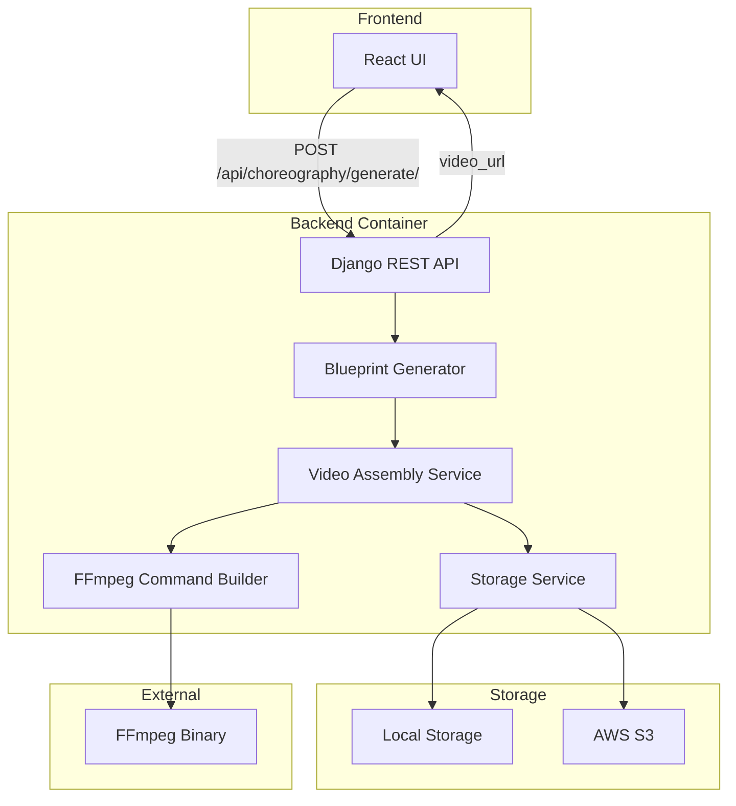
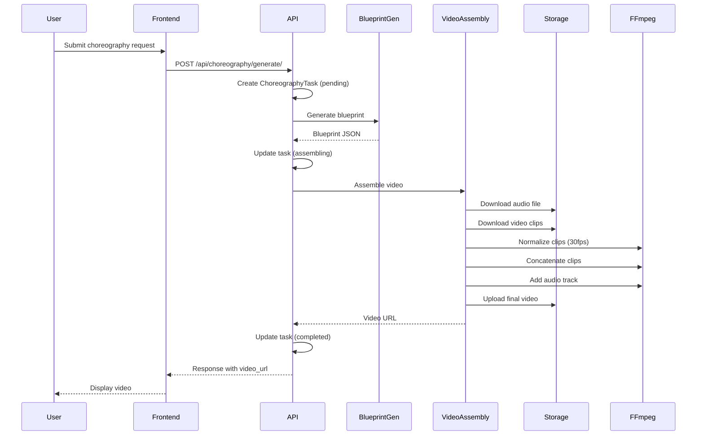

# Design Document: Job Integration

## Overview

This design describes the integration of video assembly functionality from the separate job container into the main Django backend. The integration simplifies the architecture by eliminating the job container, job queues, and asynchronous polling in favor of synchronous, blocking video generation within HTTP requests.

The key architectural change is moving from:
```
Frontend → Backend (blueprint) → Job Container (video assembly) → Storage
```

To:
```
Frontend → Backend (blueprint + video assembly) → Storage
```

## Architecture

### High-Level Architecture



### Request Flow



## Components and Interfaces

### VideoAssemblyService

The core service responsible for assembling videos from blueprints.

```python
class VideoAssemblyService:
    """
    Assembles videos from blueprints using FFmpeg.
    
    This service:
    1. Validates blueprint structure
    2. Downloads media files from storage
    3. Normalizes video clips to consistent frame rate
    4. Concatenates clips using FFmpeg
    5. Adds audio track
    6. Uploads result to storage
    7. Cleans up temporary files
    """
    
    def __init__(self, storage_service: StorageBackend):
        """Initialize with storage service."""
        pass
    
    def check_ffmpeg_available(self) -> bool:
        """Verify FFmpeg is available in system PATH."""
        pass
    
    def validate_blueprint(self, blueprint: dict) -> tuple[bool, str | None]:
        """
        Validate blueprint structure and security.
        
        Returns:
            Tuple of (is_valid, error_message)
        """
        pass
    
    def assemble_video(
        self,
        blueprint: dict,
        progress_callback: Callable[[str, int, str], None] | None = None
    ) -> str:
        """
        Assemble video from blueprint.
        
        Args:
            blueprint: Blueprint dictionary with assembly instructions
            progress_callback: Optional callback(stage, progress, message)
        
        Returns:
            URL to the assembled video
            
        Raises:
            VideoAssemblyError: If assembly fails
        """
        pass
```

### FFmpegCommandBuilder

Encapsulates FFmpeg command construction.

```python
class FFmpegCommandBuilder:
    """
    Builder for FFmpeg commands with CPU-based encoding.
    """
    
    def build_normalize_command(
        self,
        input_file: str,
        output_file: str,
        frame_rate: int = 30
    ) -> list[str]:
        """Build command for normalizing video frame rate."""
        pass
    
    def build_concat_command(
        self,
        concat_file: str,
        output_file: str
    ) -> list[str]:
        """Build command for concatenating videos."""
        pass
    
    def build_add_audio_command(
        self,
        video_file: str,
        audio_file: str,
        output_file: str,
        video_codec: str = 'libx264',
        audio_codec: str = 'aac',
        video_bitrate: str = '2M',
        audio_bitrate: str = '128k'
    ) -> list[str]:
        """Build command for adding audio to video."""
        pass
```

### Updated API Endpoint

```python
@api_view(['POST'])
@permission_classes([IsAuthenticated])
def generate_choreography(request):
    """
    Generate choreography video synchronously.
    
    Request body:
        {
            "song_id": 1,
            "difficulty": "intermediate",
            "energy_level": "medium",
            "style": "modern"
        }
    
    Response (success):
        {
            "task_id": "uuid",
            "status": "completed",
            "video_url": "https://...",
            "duration_seconds": 45.2
        }
    
    Response (error):
        {
            "error": "Video assembly failed",
            "details": "FFmpeg error: ..."
        }
    """
    pass
```

## Data Models

### Blueprint Schema (unchanged)

```json
{
    "task_id": "uuid-string",
    "audio_path": "songs/bachata-rosa.mp3",
    "moves": [
        {
            "video_path": "clips/basic-step.mp4",
            "start_time": 0.0,
            "duration": 4.0
        }
    ],
    "output_config": {
        "output_path": "output/user_1/choreo_uuid.mp4",
        "video_codec": "libx264",
        "audio_codec": "aac",
        "video_bitrate": "2M",
        "audio_bitrate": "128k"
    }
}
```

### ChoreographyTask Model (simplified)

```python
class ChoreographyTask(models.Model):
    task_id = models.UUIDField(primary_key=True, default=uuid.uuid4)
    user = models.ForeignKey(User, on_delete=models.CASCADE)
    status = models.CharField(max_length=20, choices=STATUS_CHOICES)
    progress = models.IntegerField(default=0)
    stage = models.CharField(max_length=50, blank=True)
    message = models.TextField(blank=True)
    result = models.JSONField(null=True, blank=True)
    error = models.TextField(blank=True)
    song = models.ForeignKey(Song, on_delete=models.SET_NULL, null=True)
    created_at = models.DateTimeField(auto_now_add=True)
    updated_at = models.DateTimeField(auto_now=True)
    
    # REMOVED: job_execution_name field
```

## Correctness Properties

*A property is a characteristic or behavior that should hold true across all valid executions of a system-essentially, a formal statement about what the system should do. Properties serve as the bridge between human-readable specifications and machine-verifiable correctness guarantees.*

Based on the prework analysis, the following properties can be tested:

### Property 1: Blueprint round-trip consistency
*For any* valid blueprint dictionary, serializing to JSON and deserializing back SHALL produce an equivalent dictionary with identical task_id, audio_path, moves, and output_config.
**Validates: Requirements 3.4**

### Property 2: Blueprint validation rejects missing fields
*For any* blueprint missing one or more required fields (task_id, audio_path, moves, output_config), validation SHALL return is_valid=False with a descriptive error message.
**Validates: Requirements 3.2**

### Property 3: Blueprint validation rejects invalid paths
*For any* blueprint containing paths with directory traversal sequences (..) or absolute paths starting with /, validation SHALL return is_valid=False with a security error.
**Validates: Requirements 3.3**

### Property 4: Successful assembly returns valid URL
*For any* valid blueprint with existing source files, video assembly SHALL return a non-empty string URL pointing to the output location.
**Validates: Requirements 1.2**

### Property 5: Failed assembly includes error details
*For any* blueprint that causes assembly failure (missing files, FFmpeg errors), the error response SHALL contain a non-empty error message describing the failure.
**Validates: Requirements 1.3, 6.2**

### Property 6: Temporary files cleaned up on success
*For any* successful video assembly, the temporary directory used for intermediate files SHALL be empty or deleted after completion.
**Validates: Requirements 8.4**

### Property 7: Temporary files cleaned up on error
*For any* video assembly that fails with an error, the temporary directory used for intermediate files SHALL be empty or deleted before the error is raised.
**Validates: Requirements 6.5**

### Property 8: Task error recording
*For any* video assembly error, the corresponding ChoreographyTask record SHALL have a non-empty error field containing the error details.
**Validates: Requirements 4.3**

## Error Handling

### Error Categories

1. **Validation Errors** (400 Bad Request)
   - Missing required blueprint fields
   - Invalid path formats (security)
   - Invalid parameter values

2. **Resource Errors** (404 Not Found)
   - Song not found
   - Source video file not found
   - Audio file not found

3. **Processing Errors** (500 Internal Server Error)
   - FFmpeg not available
   - FFmpeg execution failed
   - Storage upload failed

4. **Timeout Errors** (504 Gateway Timeout)
   - Video assembly exceeded 10 minute limit

### Error Response Format

```json
{
    "error": "Human-readable error message",
    "details": "Technical details for debugging",
    "stage": "Stage where error occurred (validation, fetching, concatenating, etc.)"
}
```

### Cleanup on Error

All error paths must ensure:
1. Temporary files are deleted
2. Task record is updated with error details
3. Partial uploads are cleaned up

## Testing Strategy

### Property-Based Testing

The project will use **Hypothesis** for property-based testing in Python. Each correctness property will be implemented as a property-based test with a minimum of 100 iterations.

Test file: `backend/services/test_video_assembly_properties.py`

Each property-based test must:
- Be tagged with the format: `**Feature: job-integration, Property {number}: {property_text}**`
- Reference the requirements clause it validates
- Use Hypothesis strategies to generate test inputs

### Unit Tests

Unit tests will cover:
- FFmpegCommandBuilder command generation
- Blueprint validation edge cases
- Storage service integration
- API endpoint responses

### Integration Tests

Integration tests will verify:
- End-to-end video generation flow
- Storage backend switching (local vs S3)
- Error handling across component boundaries

### Test Configuration

```python
# pytest configuration in pyproject.toml
[tool.pytest.ini_options]
testpaths = ["backend"]
python_files = ["test_*.py"]
python_functions = ["test_*"]

# Hypothesis settings
[tool.hypothesis]
max_examples = 100
deadline = 60000  # 60 seconds for video operations
```

## File Structure

```
bachata_buddy/
├── backend/
│   ├── services/
│   │   ├── video_assembly_service.py    # NEW: Video assembly logic
│   │   ├── ffmpeg_builder.py            # NEW: FFmpeg command builder
│   │   ├── test_video_assembly_properties.py  # NEW: Property tests
│   │   ├── blueprint_generator.py       # EXISTING: Blueprint generation
│   │   ├── storage_service.py           # EXISTING: Storage abstraction
│   │   └── storage/                     # EXISTING: Storage backends
│   ├── apps/
│   │   └── choreography/
│   │       ├── views.py                 # MODIFIED: New generate endpoint
│   │       └── models.py                # MODIFIED: Remove job_execution_name
│   └── pyproject.toml                   # NEW: Dependencies with UV
├── job/                                 # DELETED: Entire directory
└── docker-compose.yml                   # MODIFIED: Remove job service
```

## Dependencies

### New Dependencies (pyproject.toml)

```toml
[project]
name = "bachata-buddy-backend"
version = "1.0.0"
requires-python = ">=3.11"

dependencies = [
    "django>=4.2",
    "djangorestframework>=3.14",
    "psycopg2-binary>=2.9",
    "boto3>=1.28",
    "google-cloud-aiplatform>=1.36",
    "hypothesis>=6.92",
    "pytest>=7.4",
    # ... other existing dependencies
]

[tool.uv]
dev-dependencies = [
    "pytest>=7.4",
    "hypothesis>=6.92",
    "pytest-django>=4.5",
]
```

### System Dependencies

- FFmpeg (must be installed in container/system)
- Python 3.11+
- UV package manager
