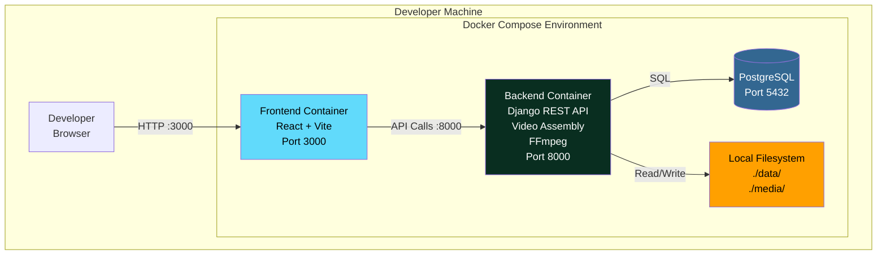
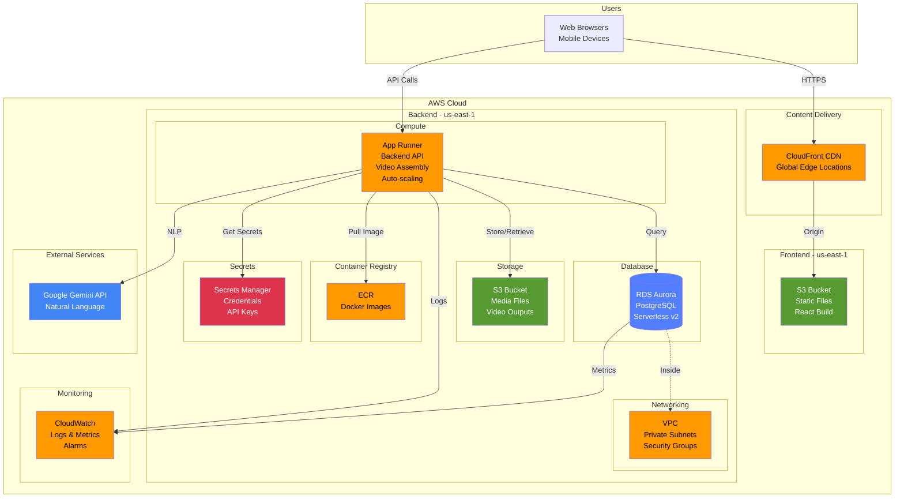
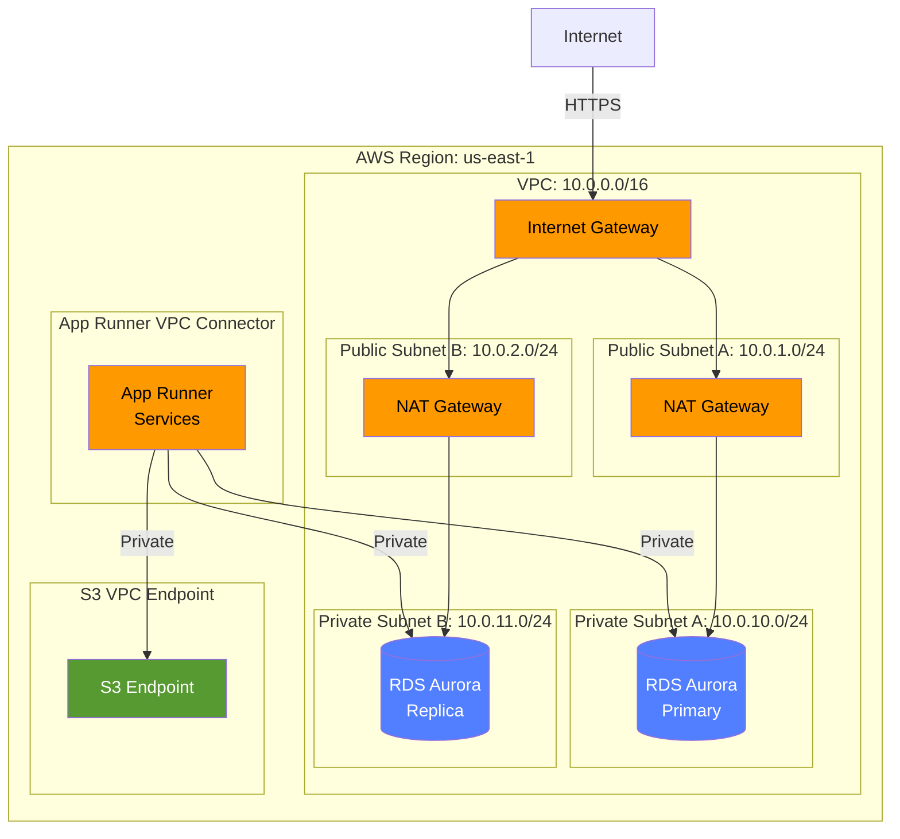
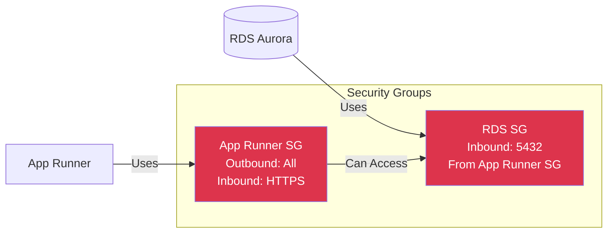
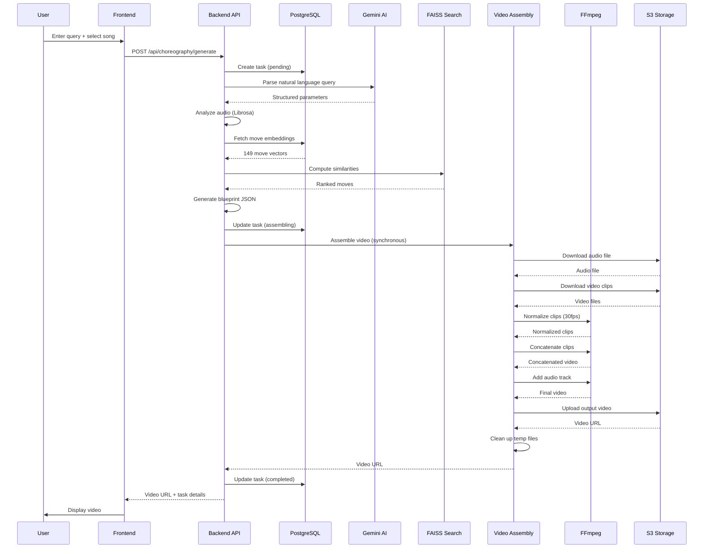
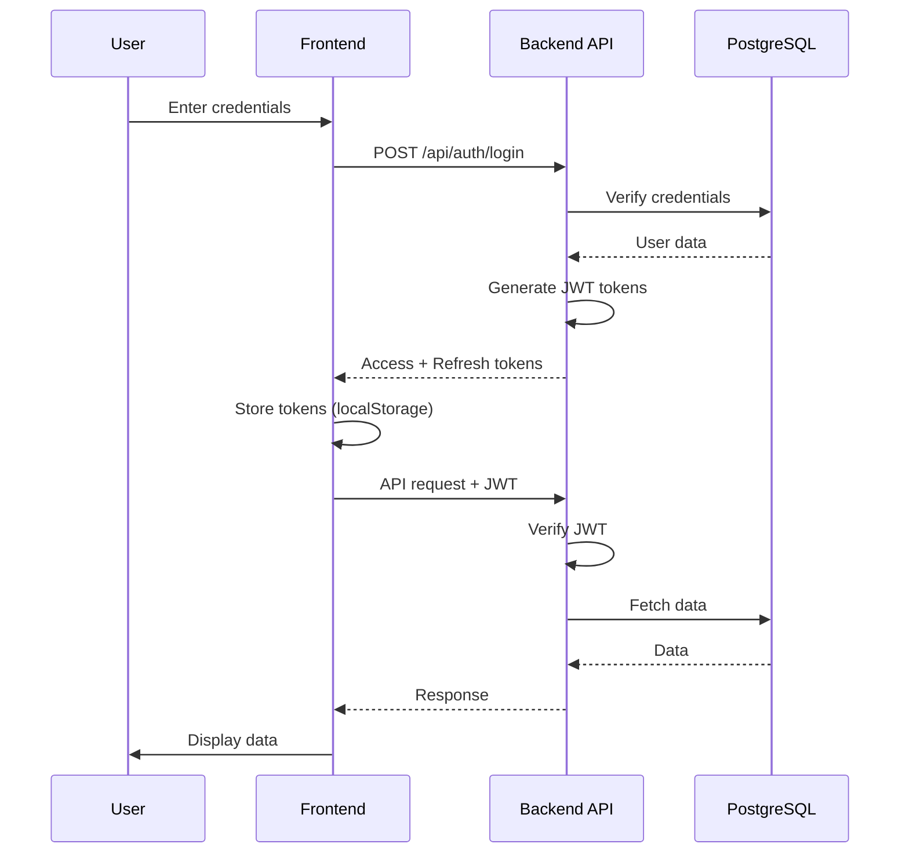

# System Architecture

This document describes the complete system architecture for Bachata Buddy, including local development and AWS production deployment.

## Table of Contents

- [Overview](#overview)
- [Local Development Architecture](#local-development-architecture)
- [AWS Production Architecture](#aws-production-architecture)
- [Component Details](#component-details)
- [Data Flow](#data-flow)
- [Security Architecture](#security-architecture)
- [Scalability](#scalability)
- [Monitoring](#monitoring)

## Overview

Bachata Buddy is a multi-tier application that generates AI-powered dance choreographies using:
- **Backend**: Django REST API (Python 3.12) with integrated video assembly
- **Frontend**: React SPA (Vite)
- **Database**: PostgreSQL 15
- **Storage**: Local filesystem (dev) or S3 (production)

## Local Development Architecture

### System Diagram



### Docker Compose Services

| Service | Image | Ports | Purpose |
|---------|-------|-------|---------|
| **frontend** | node:18 | 3000 | React development server |
| **backend** | python:3.12 | 8000 | Django API server with video assembly |
| **postgres** | postgres:15 | 5432 | Database |

### Local Storage Structure

```
bachata_buddy/
├── data/
│   ├── Bachata_steps/          # 150 video clips (source)
│   ├── songs/                  # Audio files
│   └── output/                 # Generated choreographies
├── media/                      # User uploads
└── backend/
    └── staticfiles/            # Django static files
```

## AWS Production Architecture

### High-Level Architecture



### Network Architecture



### Security Groups



## Component Details

### Frontend (React + Vite)

**Technology Stack:**
- React 18.3.1
- Vite 5.0 (build tool)
- Tailwind CSS 3.3
- React Router 6

**Deployment:**
- **Local**: Vite dev server (port 3000)
- **Production**: S3 + CloudFront
  - Build artifacts uploaded to S3
  - CloudFront serves with global caching
  - Custom domain (optional)

**Key Features:**
- Single Page Application (SPA)
- Client-side routing
- JWT authentication
- API integration via fetch

### Backend (Django REST API)

**Technology Stack:**
- Django 5.2
- Django REST Framework
- Python 3.12
- UV (package manager)
- FFmpeg (video processing)
- Gunicorn (production server)

**Deployment:**
- **Local**: Django dev server (port 8000)
- **Production**: App Runner
  - Containerized with Docker
  - Auto-scaling (1-10 instances)
  - Health checks enabled
  - Environment variables from Secrets Manager

**Key Services:**
- User authentication (JWT)
- Choreography generation (synchronous)
- Blueprint creation
- Video assembly (FFmpeg-based)
- Audio analysis (Librosa)
- Text embeddings (Sentence-Transformers)
- Vector search (FAISS)
- Gemini AI integration

**Resource Configuration:**
- CPU: 2 vCPU
- Memory: 2 GB
- Timeout: 600 seconds (increased for video processing)
- Concurrency: 100 requests/instance

### Video Assembly (Integrated in Backend)

**Technology Stack:**
- FFmpeg
- Python subprocess management
- Blueprint-based architecture

**Architecture:**
- Integrated directly into the Django backend
- Executes synchronously within HTTP requests
- No separate container or service required

**Key Functions:**
- Parse blueprint JSON
- Fetch video clips from storage
- Normalize clips to 30fps
- Concatenate clips with FFmpeg
- Add audio track
- Upload output to storage
- Clean up temporary files

**Process Flow:**
1. Validate blueprint structure and security
2. Download audio and video files from storage
3. Normalize all clips to consistent frame rate (30fps)
4. Create FFmpeg concat file
5. Concatenate clips into single video
6. Add audio track to video
7. Upload final video to storage
8. Clean up temporary files
9. Return video URL

### Database (PostgreSQL)

**Technology Stack:**
- PostgreSQL 15
- Django ORM

**Deployment:**
- **Local**: Docker container (port 5432)
- **Production**: RDS Aurora Serverless v2
  - Multi-AZ for high availability
  - Automatic backups (7-day retention)
  - Automated patching
  - SSL/TLS connections required

**Schema:**
- Users and authentication
- Choreography tasks and blueprints
- Move embeddings (1792D vectors)
- Collections and favorites
- Instructor data

**Resource Configuration:**
- Min ACU: 0.5
- Max ACU: 2
- Storage: Auto-scaling (10 GB - 64 TB)
- Backup retention: 7 days

### Storage

**Local Development:**
- Filesystem: `./data/` and `./media/`
- Direct file access
- No CDN

**Production (S3):**
- **Media Bucket**: Video clips, audio files, outputs
- **Frontend Bucket**: React build artifacts
- Versioning enabled
- Lifecycle policies for cost optimization
- CloudFront CDN for global delivery

**Storage Structure:**
```
s3://bachata-buddy-media/
├── clips/                  # Source video clips
├── songs/                  # Audio files
├── outputs/                # Generated choreographies
└── uploads/                # User uploads

s3://bachata-buddy-frontend/
├── index.html
├── assets/
│   ├── *.js
│   ├── *.css
│   └── *.png
└── favicon.ico
```

## Video Assembly Architecture

### Overview

Video assembly is now integrated directly into the Django backend, executing synchronously within HTTP requests. This eliminates the need for a separate job container, job queues, and asynchronous polling.

### Components

**VideoAssemblyService:**
- Core service for video assembly
- Validates blueprint structure and security
- Downloads media files from storage
- Orchestrates FFmpeg operations
- Uploads results and cleans up temporary files

**FFmpegCommandBuilder:**
- Constructs FFmpeg commands for video operations
- Supports frame rate normalization (30fps)
- Handles video concatenation
- Manages audio track addition
- Uses CPU-based encoding (libx264, aac)

**Blueprint Format:**
```json
{
    "task_id": "uuid",
    "audio_path": "songs/song.mp3",
    "moves": [
        {
            "video_path": "clips/move.mp4",
            "start_time": 0.0,
            "duration": 4.0
        }
    ],
    "output_config": {
        "output_path": "output/user_1/video.mp4",
        "video_codec": "libx264",
        "audio_codec": "aac",
        "video_bitrate": "2M",
        "audio_bitrate": "128k"
    }
}
```

### Processing Pipeline

1. **Validation**: Check blueprint structure, required fields, and path security
2. **Fetching (20%)**: Download audio and video files from storage
3. **Normalization**: Convert all clips to 30fps for consistency
4. **Concatenation (50%)**: Merge clips using FFmpeg concat demuxer
5. **Audio Addition (70%)**: Add audio track to video
6. **Upload (85%)**: Upload final video to storage
7. **Cleanup (95%)**: Remove temporary files
8. **Complete (100%)**: Return video URL

### Error Handling

- **Validation errors**: Invalid blueprint structure or paths
- **Resource errors**: Missing audio or video files
- **FFmpeg errors**: Processing failures with detailed output
- **Storage errors**: Upload/download failures
- **Timeout**: 10-minute limit per request
- All errors trigger automatic cleanup of temporary files

### Dependencies

- **Python**: 3.12+
- **UV**: Package manager for dependency management
- **FFmpeg**: System binary for video processing
- **Storage Service**: Abstraction for local/S3 storage
- **Hypothesis**: Property-based testing framework

## Data Flow

### Choreography Generation Flow (Synchronous)



### Authentication Flow



## Security Architecture

### Authentication & Authorization

**JWT-Based Authentication:**
- Access tokens (15 min expiry)
- Refresh tokens (7 day expiry)
- Secure HTTP-only cookies (production)
- Token rotation on refresh

**Authorization:**
- Role-based access control (RBAC)
- User, Instructor, Admin roles
- Permission-based API endpoints

### Network Security

**VPC Configuration:**
- Private subnets for RDS
- NAT Gateways for outbound traffic
- Security groups for access control
- VPC endpoints for S3 (private access)

**Security Groups:**
- App Runner: Outbound all, Inbound HTTPS only
- RDS: Inbound 5432 from App Runner SG only
- No public internet access to RDS

### Data Security

**Encryption:**
- **In Transit**: TLS 1.2+ for all connections
- **At Rest**: 
  - RDS: AES-256 encryption
  - S3: Server-side encryption (SSE-S3)
  - Secrets Manager: KMS encryption

**Secrets Management:**
- AWS Secrets Manager for credentials
- No secrets in code or environment files
- Automatic rotation (optional)

### Application Security

**Django Security Settings:**
```python
# Production settings
DEBUG = False
SECURE_SSL_REDIRECT = True
SESSION_COOKIE_SECURE = True
CSRF_COOKIE_SECURE = True
SECURE_HSTS_SECONDS = 31536000
SECURE_CONTENT_TYPE_NOSNIFF = True
SECURE_BROWSER_XSS_FILTER = True
X_FRAME_OPTIONS = 'DENY'
```

**CORS Configuration:**
- Specific allowed origins (CloudFront domain)
- No wildcard origins in production
- Credentials allowed for authenticated requests

**Input Validation:**
- Django REST Framework serializers
- SQL injection prevention (ORM)
- XSS prevention (template escaping)
- CSRF protection

## Scalability

### Horizontal Scaling

**App Runner Auto-Scaling:**
- Backend: 1-10 instances
- Metrics: CPU, Memory, Request count
- Scale-up: 70% CPU or 80% memory
- Scale-down: 30% CPU and 50% memory
- Note: Video assembly is CPU-intensive and may trigger scaling

**RDS Aurora Scaling:**
- Serverless v2: 0.5-2 ACU
- Automatic scaling based on load
- Read replicas (optional)

### Vertical Scaling

**Resource Limits:**
- Backend: 2 vCPU, 2 GB RAM (includes video assembly)
- Can be increased via CDK configuration
- Video assembly may benefit from additional CPU resources

### Caching Strategy

**CloudFront Caching:**
- Static assets: 1 year TTL
- HTML: 5 minutes TTL
- API responses: No caching

**Application Caching:**
- FAISS index: In-memory (rebuilt on startup)
- Move embeddings: Database query caching
- Django query caching (optional)

## Monitoring

### CloudWatch Metrics

**App Runner Metrics:**
- Request count
- Response time (p50, p90, p99) - may be higher due to synchronous video assembly
- Error rate (4xx, 5xx)
- CPU utilization - spikes during video processing
- Memory utilization
- Active instances

**RDS Metrics:**
- Database connections
- CPU utilization
- Storage usage
- Read/Write IOPS
- Query performance

**S3 Metrics:**
- Request count
- Data transfer
- Error rate

### CloudWatch Logs

**Log Groups:**
- `/aws/apprunner/backend` - Backend API logs (includes video assembly logs)
- `/aws/rds/cluster/<cluster-id>` - Database logs

**Log Retention:**
- 30 days (configurable)
- Export to S3 for long-term storage

### CloudWatch Alarms

**Critical Alarms:**
- App Runner error rate > 5%
- RDS CPU > 80%
- RDS storage > 85%
- App Runner response time > 10 minutes (timeout threshold)

**Warning Alarms:**
- App Runner error rate > 1%
- RDS CPU > 60%
- Video assembly time > 5 minutes

### Distributed Tracing

**AWS X-Ray (Optional):**
- Request tracing across services
- Performance bottleneck identification
- Error analysis

## Performance Optimization

### Backend Optimization

- Database connection pooling
- Query optimization (indexes, select_related)
- Lazy loading of embeddings
- FFmpeg command optimization (CPU-based encoding)
- Temporary file cleanup
- Efficient video normalization (30fps standard)

### Frontend Optimization

- Code splitting (React.lazy)
- Asset compression (gzip, brotli)
- Image optimization
- CDN caching

### Database Optimization

- Indexes on frequently queried fields
- Query result caching
- Connection pooling
- Read replicas for read-heavy workloads

## Disaster Recovery

### Backup Strategy

**RDS Backups:**
- Automated daily backups (7-day retention)
- Manual snapshots before major changes
- Point-in-time recovery (PITR)

**S3 Versioning:**
- Enabled on media bucket
- Lifecycle policies for old versions

### Recovery Procedures

**Database Recovery:**
1. Restore from automated backup
2. Or restore from manual snapshot
3. Update App Runner environment variables
4. Verify data integrity

**Application Recovery:**
1. Rollback to previous Docker image
2. Or redeploy from Git tag
3. Verify functionality

**Infrastructure Recovery:**
1. CDK destroy and redeploy
2. Or restore from CloudFormation snapshot
3. Restore database from backup
4. Redeploy applications

## Cost Optimization

### Strategies

1. **App Runner**: Scale to zero for job service
2. **RDS**: Serverless v2 with low min ACU
3. **S3**: Lifecycle policies to Glacier
4. **CloudFront**: Optimize cache hit ratio
5. **Monitoring**: Set appropriate log retention

### Cost Breakdown

| Service | Monthly Cost | Optimization |
|---------|-------------|--------------|
| App Runner (Backend) | $75-150 | Right-size instances, increased for video processing |
| RDS Aurora | $50-150 | Serverless v2, low min ACU |
| S3 | $10-30 | Lifecycle policies |
| CloudFront | $20-50 | Cache optimization |
| **Total** | **$155-380** | |

**Note:** Consolidating video assembly into the backend reduces infrastructure complexity and eliminates the separate job service cost, but may increase backend resource usage.

## Migration from Job Container

### Previous Architecture

The system previously used a separate job container for video assembly:
- Backend generated blueprints and triggered jobs
- Job container processed videos asynchronously
- Frontend polled for task status
- Required job orchestration (mock/AWS/Celery modes)

### Current Architecture

Video assembly is now integrated into the backend:
- Single container deployment
- Synchronous video generation
- Immediate response with video URL
- Simplified infrastructure and deployment
- No job queues or polling required

### Benefits

1. **Simplified Architecture**: One container instead of two
2. **Reduced Latency**: No job queue overhead
3. **Better Error Handling**: Immediate error feedback
4. **Easier Development**: Single service to run and debug
5. **Lower Costs**: Fewer resources to manage
6. **Simpler Deployment**: Single Docker image

### Trade-offs

1. **Request Duration**: Longer HTTP requests (30s-5min typical)
2. **Resource Usage**: Backend needs more CPU/memory
3. **Concurrency**: Limited by backend instance capacity
4. **Timeout Risk**: Must complete within 10-minute limit

## Future Enhancements

- Multi-region deployment for global users
- ElastiCache for application caching
- Async job queue for very long videos (optional)
- Lambda for serverless functions
- API Gateway for advanced routing
- WAF for DDoS protection
- Route 53 for DNS management
- Certificate Manager for SSL/TLS
- GPU-accelerated FFmpeg encoding
