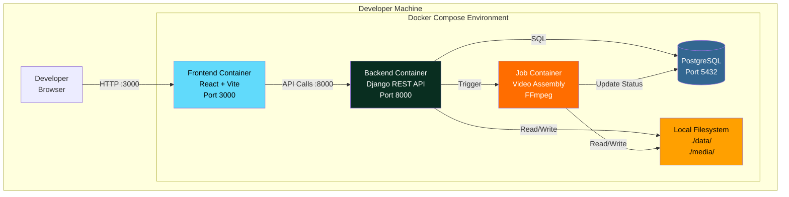
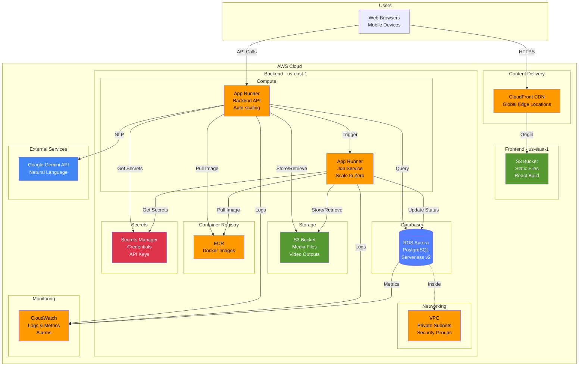
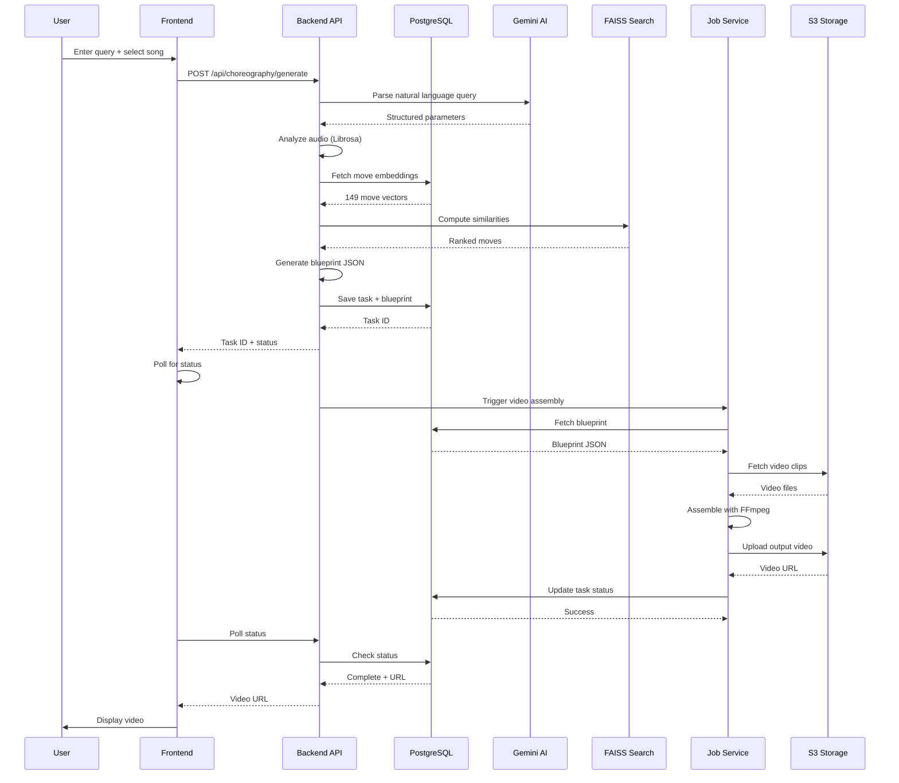

# System Architecture

This document describes the complete system architecture for Bachata Buddy, including local development and AWS production deployment.

## Table of Contents

- [Overview](#overview)
- [Local Development Architecture](#local-development-architecture)
- [AWS Production Architecture](#aws-production-architecture)
- [Component Details](#component-details)
- [Data Flow](#data-flow)
- [Security Architecture](#security-architecture)
- [Scalability](#scalability)
- [Monitoring](#monitoring)

## Overview

Bachata Buddy is a multi-tier application that generates AI-powered dance choreographies using:
- **Backend**: Django REST API (Python 3.12)
- **Frontend**: React SPA (Vite)
- **Database**: PostgreSQL 15
- **Storage**: Local filesystem (dev) or S3 (production)
- **Jobs**: Background video processing service

## Local Development Architecture

### System Diagram



### Docker Compose Services

| Service | Image | Ports | Purpose |
|---------|-------|-------|---------|
| **frontend** | node:18 | 3000 | React development server |
| **backend** | python:3.12 | 8000 | Django API server |
| **postgres** | postgres:15 | 5432 | Database |
| **job** | python:3.12 | - | Video processing (triggered) |

### Local Storage Structure

```
bachata_buddy/
├── data/
│   ├── Bachata_steps/          # 150 video clips (source)
│   ├── songs/                  # Audio files
│   └── output/                 # Generated choreographies
├── media/                      # User uploads
└── backend/
    └── staticfiles/            # Django static files
```

## AWS Production Architecture

### High-Level Architecture



### Network Architecture


### Security Groups


## Component Details

### Frontend (React + Vite)

**Technology Stack:**
- React 18.3.1
- Vite 5.0 (build tool)
- Tailwind CSS 3.3
- React Router 6

**Deployment:**
- **Local**: Vite dev server (port 3000)
- **Production**: S3 + CloudFront
  - Build artifacts uploaded to S3
  - CloudFront serves with global caching
  - Custom domain (optional)

**Key Features:**
- Single Page Application (SPA)
- Client-side routing
- JWT authentication
- API integration via fetch

### Backend (Django REST API)

**Technology Stack:**
- Django 5.2
- Django REST Framework
- Python 3.12
- Gunicorn (production server)

**Deployment:**
- **Local**: Django dev server (port 8000)
- **Production**: App Runner
  - Containerized with Docker
  - Auto-scaling (1-10 instances)
  - Health checks enabled
  - Environment variables from Secrets Manager

**Key Services:**
- User authentication (JWT)
- Choreography generation
- Blueprint creation
- Audio analysis (Librosa)
- Text embeddings (Sentence-Transformers)
- Vector search (FAISS)
- Gemini AI integration

**Resource Configuration:**
- CPU: 2 vCPU
- Memory: 2 GB
- Timeout: 300 seconds
- Concurrency: 100 requests/instance

### Job Service (Video Assembly)

**Technology Stack:**
- Python 3.12
- FFmpeg
- Blueprint-based architecture

**Deployment:**
- **Local**: Docker container (triggered by API)
- **Production**: App Runner
  - Containerized with Docker
  - Scale to zero when idle
  - Triggered by API via HTTP
  - Processes blueprints from database

**Key Functions:**
- Parse blueprint JSON
- Fetch video clips from storage
- Assemble video with FFmpeg
- Upload output to storage
- Update task status in database

**Resource Configuration:**
- CPU: 1 vCPU
- Memory: 512 MB
- Timeout: 300 seconds
- Concurrency: 1 job/instance
- Min instances: 0 (scale to zero)
- Max instances: 5

### Database (PostgreSQL)

**Technology Stack:**
- PostgreSQL 15
- Django ORM

**Deployment:**
- **Local**: Docker container (port 5432)
- **Production**: RDS Aurora Serverless v2
  - Multi-AZ for high availability
  - Automatic backups (7-day retention)
  - Automated patching
  - SSL/TLS connections required

**Schema:**
- Users and authentication
- Choreography tasks and blueprints
- Move embeddings (1792D vectors)
- Collections and favorites
- Instructor data

**Resource Configuration:**
- Min ACU: 0.5
- Max ACU: 2
- Storage: Auto-scaling (10 GB - 64 TB)
- Backup retention: 7 days

### Storage

**Local Development:**
- Filesystem: `./data/` and `./media/`
- Direct file access
- No CDN

**Production (S3):**
- **Media Bucket**: Video clips, audio files, outputs
- **Frontend Bucket**: React build artifacts
- Versioning enabled
- Lifecycle policies for cost optimization
- CloudFront CDN for global delivery

**Storage Structure:**
```
s3://bachata-buddy-media/
├── clips/                  # Source video clips
├── songs/                  # Audio files
├── outputs/                # Generated choreographies
└── uploads/                # User uploads

s3://bachata-buddy-frontend/
├── index.html
├── assets/
│   ├── *.js
│   ├── *.css
│   └── *.png
└── favicon.ico
```

## Data Flow

### Choreography Generation Flow



### Authentication Flow


## Security Architecture

### Authentication & Authorization

**JWT-Based Authentication:**
- Access tokens (15 min expiry)
- Refresh tokens (7 day expiry)
- Secure HTTP-only cookies (production)
- Token rotation on refresh

**Authorization:**
- Role-based access control (RBAC)
- User, Instructor, Admin roles
- Permission-based API endpoints

### Network Security

**VPC Configuration:**
- Private subnets for RDS
- NAT Gateways for outbound traffic
- Security groups for access control
- VPC endpoints for S3 (private access)

**Security Groups:**
- App Runner: Outbound all, Inbound HTTPS only
- RDS: Inbound 5432 from App Runner SG only
- No public internet access to RDS

### Data Security

**Encryption:**
- **In Transit**: TLS 1.2+ for all connections
- **At Rest**: 
  - RDS: AES-256 encryption
  - S3: Server-side encryption (SSE-S3)
  - Secrets Manager: KMS encryption

**Secrets Management:**
- AWS Secrets Manager for credentials
- No secrets in code or environment files
- Automatic rotation (optional)

### Application Security

**Django Security Settings:**
```python
# Production settings
DEBUG = False
SECURE_SSL_REDIRECT = True
SESSION_COOKIE_SECURE = True
CSRF_COOKIE_SECURE = True
SECURE_HSTS_SECONDS = 31536000
SECURE_CONTENT_TYPE_NOSNIFF = True
SECURE_BROWSER_XSS_FILTER = True
X_FRAME_OPTIONS = 'DENY'
```

**CORS Configuration:**
- Specific allowed origins (CloudFront domain)
- No wildcard origins in production
- Credentials allowed for authenticated requests

**Input Validation:**
- Django REST Framework serializers
- SQL injection prevention (ORM)
- XSS prevention (template escaping)
- CSRF protection

## Scalability

### Horizontal Scaling

**App Runner Auto-Scaling:**
- Backend: 1-10 instances
- Job: 0-5 instances (scale to zero)
- Metrics: CPU, Memory, Request count
- Scale-up: 70% CPU or 80% memory
- Scale-down: 30% CPU and 50% memory

**RDS Aurora Scaling:**
- Serverless v2: 0.5-2 ACU
- Automatic scaling based on load
- Read replicas (optional)

### Vertical Scaling

**Resource Limits:**
- Backend: 2 vCPU, 2 GB RAM
- Job: 1 vCPU, 512 MB RAM
- Can be increased via CDK configuration

### Caching Strategy

**CloudFront Caching:**
- Static assets: 1 year TTL
- HTML: 5 minutes TTL
- API responses: No caching

**Application Caching:**
- FAISS index: In-memory (rebuilt on startup)
- Move embeddings: Database query caching
- Django query caching (optional)

## Monitoring

### CloudWatch Metrics

**App Runner Metrics:**
- Request count
- Response time (p50, p90, p99)
- Error rate (4xx, 5xx)
- CPU utilization
- Memory utilization
- Active instances

**RDS Metrics:**
- Database connections
- CPU utilization
- Storage usage
- Read/Write IOPS
- Query performance

**S3 Metrics:**
- Request count
- Data transfer
- Error rate

### CloudWatch Logs

**Log Groups:**
- `/aws/apprunner/backend` - Backend API logs
- `/aws/apprunner/job` - Job service logs
- `/aws/rds/cluster/<cluster-id>` - Database logs

**Log Retention:**
- 30 days (configurable)
- Export to S3 for long-term storage

### CloudWatch Alarms

**Critical Alarms:**
- App Runner error rate > 5%
- RDS CPU > 80%
- RDS storage > 85%
- App Runner response time > 5s

**Warning Alarms:**
- App Runner error rate > 1%
- RDS CPU > 60%
- Job processing time > 10 minutes

### Distributed Tracing

**AWS X-Ray (Optional):**
- Request tracing across services
- Performance bottleneck identification
- Error analysis

## Performance Optimization

### Backend Optimization

- Database connection pooling
- Query optimization (indexes, select_related)
- Lazy loading of embeddings
- Async task processing

### Frontend Optimization

- Code splitting (React.lazy)
- Asset compression (gzip, brotli)
- Image optimization
- CDN caching

### Database Optimization

- Indexes on frequently queried fields
- Query result caching
- Connection pooling
- Read replicas for read-heavy workloads

## Disaster Recovery

### Backup Strategy

**RDS Backups:**
- Automated daily backups (7-day retention)
- Manual snapshots before major changes
- Point-in-time recovery (PITR)

**S3 Versioning:**
- Enabled on media bucket
- Lifecycle policies for old versions

### Recovery Procedures

**Database Recovery:**
1. Restore from automated backup
2. Or restore from manual snapshot
3. Update App Runner environment variables
4. Verify data integrity

**Application Recovery:**
1. Rollback to previous Docker image
2. Or redeploy from Git tag
3. Verify functionality

**Infrastructure Recovery:**
1. CDK destroy and redeploy
2. Or restore from CloudFormation snapshot
3. Restore database from backup
4. Redeploy applications

## Cost Optimization

### Strategies

1. **App Runner**: Scale to zero for job service
2. **RDS**: Serverless v2 with low min ACU
3. **S3**: Lifecycle policies to Glacier
4. **CloudFront**: Optimize cache hit ratio
5. **Monitoring**: Set appropriate log retention

### Cost Breakdown

| Service | Monthly Cost | Optimization |
|---------|-------------|--------------|
| App Runner (Backend) | $50-100 | Right-size instances |
| App Runner (Job) | $20-50 | Scale to zero |
| RDS Aurora | $50-150 | Serverless v2, low min ACU |
| S3 | $10-30 | Lifecycle policies |
| CloudFront | $20-50 | Cache optimization |
| **Total** | **$150-380** | |

## Future Enhancements

- Multi-region deployment for global users
- ElastiCache for application caching
- SQS for job queue management
- Lambda for serverless functions
- API Gateway for advanced routing
- WAF for DDoS protection
- Route 53 for DNS management
- Certificate Manager for SSL/TLS
