# 🏗️ Google Cloud Deployment Architecture

## Complete System Deployment with Blueprint Communication


## Blueprint Communication Flow (Detailed)

```mermaid
sequenceDiagram
    participant User as 👤 User Browser
    participant FE as 🌐 Frontend<br/>Cloud Run
    participant API as 🔧 Backend API<br/>Cloud Run
    participant BG as Blueprint<br/>Generator
    participant SQL as 🗄️ Cloud SQL<br/>PostgreSQL
    participant JOB as 🎬 Job Container<br/>Cloud Run Job
    participant GCS as ☁️ Cloud Storage
    participant GEMINI as 🤖 Gemini AI
    
    %% User Request
    User->>FE: 1. Request Choreography<br/>(song, difficulty, style)
    FE->>API: 2. POST /api/choreography/generate-from-song/
    
    %% Task Creation
    API->>SQL: 3. Create ChoreographyTask<br/>(status: pending, stage: generating_blueprint)
    SQL-->>API: task_id
    API-->>FE: 202 Accepted {task_id}
    FE-->>User: Show progress UI
    
    %% Blueprint Generation
    API->>GEMINI: 4. Parse natural language query (optional)
    GEMINI-->>API: Parsed parameters
    
    API->>BG: 5. Generate Blueprint
    Note over BG: • Analyze song audio (Librosa)<br/>• Fetch 149 embeddings from DB<br/>• Compute trimodal similarity<br/>• Select & rank moves<br/>• Create timing & transitions
    
    BG->>SQL: 6. Fetch move embeddings<br/>(512D pose + 128D audio + 384D text)
    SQL-->>BG: 149 embeddings
    
    BG->>BG: 7. Trimodal Fusion<br/>35% text + 35% audio + 30% pose
    BG->>BG: 8. Filter by difficulty/energy/style
    BG->>BG: 9. Create Blueprint JSON
    
    Note over BG: Blueprint Contains:<br/>• task_id<br/>• audio_path: "songs/song.mp3"<br/>• moves: [{video_path, start_time, duration}]<br/>• output_config: {resolution, fps, quality}
    
    BG-->>API: Blueprint JSON (2-5KB)
    
    %% Store Blueprint
    API->>SQL: 10. Store Blueprint<br/>INSERT INTO blueprints
    API->>SQL: 11. Update Task<br/>(stage: submitting_job)
    
    %% Trigger Job
    API->>JOB: 12. Trigger Cloud Run Job<br/>ENV: BLUEPRINT_JSON="{...}"<br/>ENV: DB_HOST, DB_NAME, etc.
    API-->>FE: Blueprint generated
    
    %% Job Processing
    JOB->>JOB: 13. Parse & Validate Blueprint
    JOB->>SQL: 14. Update Task<br/>(status: running, stage: assembling)
    
    loop For each move in blueprint
        JOB->>GCS: 15. Download video clip<br/>data/Bachata_steps/basic/basic.mp4
        GCS-->>JOB: Video file
    end
    
    JOB->>GCS: 16. Download song audio<br/>songs/song.mp3
    GCS-->>JOB: Audio file
    
    JOB->>JOB: 17. FFmpeg Video Assembly<br/>• Concatenate clips<br/>• Add transitions<br/>• Sync with audio<br/>• Apply effects
    
    Note over JOB: FFmpeg Command:<br/>ffmpeg -i concat.txt -i audio.mp3<br/>-c:v libx264 -preset fast<br/>-c:a aac -b:a 192k<br/>output.mp4
    
    JOB->>GCS: 18. Upload final video<br/>choreographies/user_X/task_id.mp4
    GCS-->>JOB: Video URL
    
    JOB->>SQL: 19. Update Task<br/>(status: completed, result: {video_url})
    
    %% User Gets Result
    loop Poll for status
        FE->>API: 20. GET /api/choreography/task-status/{task_id}
        API->>SQL: Query task status
        SQL-->>API: Task data
        API-->>FE: {status, progress, stage, result}
    end
    
    FE-->>User: 21. ✅ Video Ready!<br/>Show video player
    User->>FE: 22. Watch choreography
    FE->>GCS: 23. Stream video
    GCS-->>User: Video playback
```



## Blueprint JSON Schema

```json
{
  "task_id": "abc123-def456-ghi789",
  "audio_path": "songs/bachata_rosa.mp3",
  "moves": [
    {
      "clip_id": "move_1",
      "video_path": "data/Bachata_steps/basic/basic.mp4",
      "move_name": "Basic Step",
      "start_time": 0.0,
      "duration": 8.0,
      "transition": "crossfade"
    },
    {
      "clip_id": "move_2",
      "video_path": "data/Bachata_steps/spin/double_spin.mp4",
      "move_name": "Double Spin",
      "start_time": 8.0,
      "duration": 6.5,
      "transition": "crossfade"
    }
  ],
  "output_config": {
    "output_path": "choreographies/user_1/abc123-def456-ghi789.mp4",
    "resolution": "1280x720",
    "fps": 24,
    "video_codec": "libx264",
    "audio_codec": "aac",
    "video_bitrate": "2M",
    "audio_bitrate": "192k"
  },
  "metadata": {
    "difficulty": "intermediate",
    "energy_level": "medium",
    "style": "romantic",
    "total_duration": 180.0,
    "move_count": 15
  }
}
```

## Component Communication Matrix

| From | To | Protocol | Data | Purpose |
|------|-----|----------|------|---------|
| User | Frontend | HTTPS | User actions | UI interaction |
| Frontend | Backend API | REST API | JSON requests | Choreography requests |
| Backend API | Cloud SQL | PostgreSQL | SQL queries | Data persistence |
| Backend API | Gemini AI | gRPC/REST | Text queries | NLP parsing |
| Backend API | Cloud Run Jobs | Cloud Run API | Blueprint JSON | Trigger video job |
| Job Container | Cloud SQL | PostgreSQL | Blueprint fetch | Get instructions |
| Job Container | Cloud Storage | GCS API | Media files | Download/upload |
| Job Container | Cloud SQL | PostgreSQL | Status updates | Progress tracking |
| Frontend | Backend API | REST API (polling) | Status queries | Progress monitoring |
| GPU Instance | Cloud Storage | GCS API | Embeddings | Offline generation |

## Deployment Commands

### Frontend Deployment
```bash
cd frontend
docker build -t gcr.io/PROJECT_ID/bachata-frontend .
docker push gcr.io/PROJECT_ID/bachata-frontend
gcloud run deploy bachata-frontend \
  --image gcr.io/PROJECT_ID/bachata-frontend \
  --platform managed \
  --region us-central1 \
  --memory 512Mi \
  --cpu 1
```

### Backend API Deployment
```bash
cd backend
docker build -t gcr.io/PROJECT_ID/bachata-api .
docker push gcr.io/PROJECT_ID/bachata-api
gcloud run deploy bachata-api \
  --image gcr.io/PROJECT_ID/bachata-api \
  --platform managed \
  --region us-central1 \
  --memory 2Gi \
  --cpu 2 \
  --set-env-vars DB_HOST=CLOUD_SQL_IP \
  --set-secrets DB_PASSWORD=db-password:latest
```

### Job Container Deployment
```bash
cd job
docker build -t gcr.io/PROJECT_ID/bachata-job .
docker push gcr.io/PROJECT_ID/bachata-job
gcloud run jobs create bachata-video-job \
  --image gcr.io/PROJECT_ID/bachata-job \
  --region us-central1 \
  --memory 512Mi \
  --cpu 1 \
  --max-retries 2 \
  --task-timeout 300s
```

### GPU Instance (Optional - for embedding generation)
```bash
gcloud compute instances create bachata-gpu \
  --zone us-central1-a \
  --machine-type n1-standard-4 \
  --accelerator type=nvidia-tesla-t4,count=1 \
  --image-family pytorch-latest-gpu \
  --image-project deeplearning-platform-release \
  --boot-disk-size 100GB \
  --metadata install-nvidia-driver=True
```

## Key Architecture Benefits

| Feature | Benefit | Impact |
|---------|---------|--------|
| **Blueprint-Based** | Complete instructions in JSON | Decouples API from job processing |
| **Cloud Run Jobs** | Serverless video processing | Pay only for execution time |
| **Stateless Jobs** | No state in job container | Easy scaling and retry |
| **PostgreSQL Storage** | Blueprints persisted | Job can fetch anytime |
| **Environment Variables** | Blueprint via ENV | Simple job triggering |
| **Cloud Storage** | Centralized media | Shared access for all components |
| **Secret Manager** | Secure credentials | No secrets in code |
| **IAM Roles** | Fine-grained access | Security best practices |

## Monitoring & Debugging

### Check Task Status
```bash
# Via API
curl https://api.example.com/api/choreography/task-status/TASK_ID/

# Via Database
gcloud sql connect bachata-db --user=postgres
SELECT task_id, status, stage, message FROM choreography_tasks WHERE task_id='TASK_ID';
```

### View Job Logs
```bash
# List job executions
gcloud run jobs executions list --job bachata-video-job --region us-central1

# View logs for specific execution
gcloud logging read "resource.type=cloud_run_job AND resource.labels.job_name=bachata-video-job" --limit 100
```

### Check Blueprint
```bash
# Via Database
SELECT blueprint_json FROM blueprints WHERE task_id='TASK_ID';
```

## Cost Optimization

| Strategy | Savings | Implementation |
|----------|---------|----------------|
| **Cloud Run Jobs** | 50% vs always-on | Serverless, pay per execution |
| **512MB Job Memory** | 75% vs 2GB | Minimal dependencies |
| **Local Storage** | 90% vs GCS egress | Videos on disk in job |
| **PostgreSQL** | 100% vs Elasticsearch | No separate vector DB |
| **Preemptible GPU** | 80% vs on-demand | For offline embedding generation |

**Total Monthly Cost: ~$36** (100 videos/month)
