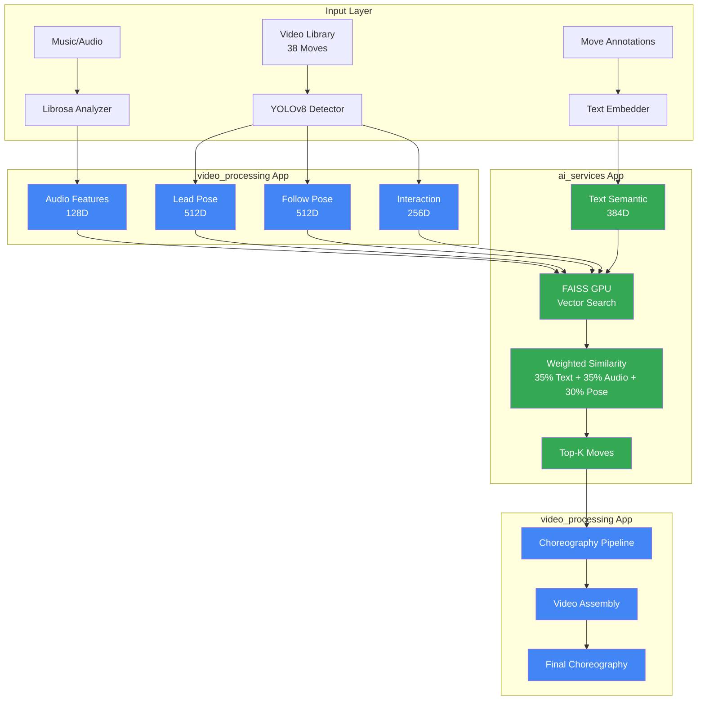
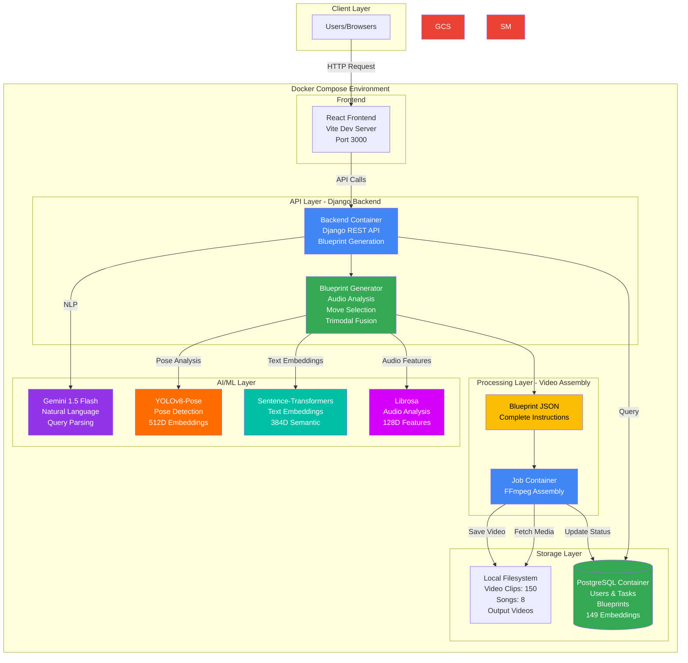
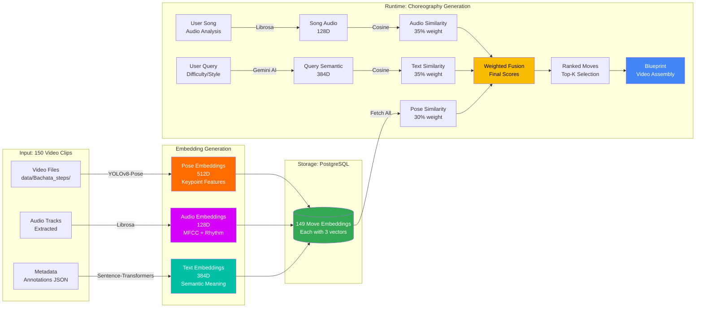

# 🎵 Bachata Buddy

**AI Bachata Choreography Generator and Library**

Bachata Buddy generates personalized Bachata choreographies using multi-modal machine learning. It combines computer vision (YOLOv8-Pose) to create couples pose embeddings, audio signal processing (Librosa) to create song embeddings, natural language understanding (Sentence-Transformers + Gemini AI), and vector similarity search (FAISS) to create text embeddings and generate contextually appropriate dance sequences from music.

> **🌟 Unique Innovation:** First open-source system to use multi-person pose detection for partner dance choreography generation with trimodal embeddings (audio + visual + semantic).

---

## 🎯 What Makes This Project Unique

### 🔬 Research-Grade Technology in Production

This isn't a typical CRUD app or simple ML demo. It's a **production-ready research system** that:

1. **Multi-Person Couple Detection** 👯
   - Simultaneously tracks BOTH dance partners (lead + follow)
   - Analyzes partner interactions (hand connections, proximity, synchronization)
   - Uses YOLOv8-Pose (modern, 70-75% mAP) with simple setup
   - **No other open-source project does this for partner dancing**

2. **Trimodal Machine Learning** 🧠
   - **Audio (35%)**: 128D music embeddings (tempo, rhythm, energy)
   - **Pose (30%)**: 1280D movement embeddings (lead 512D + follow 512D + interaction 256D)
   - **Text (35%)**: 384D semantic embeddings (move descriptions, difficulty, style)
   - **Total: 1792 dimensions** stored individually for maximum quality

3. **Production-Ready Architecture** 🏗️
   - Full Django web application with user management
   - FAISS for vector similarity search (<50ms recommendations)
   - Comprehensive testing (67%+ coverage, 30+ unit tests)
   - Docker deployment ready for AWS App Runner
   - Simple installation (just `uv sync` - no complex dependencies!)

---

## 🤖 Machine Learning Architecture

### System Overview



**Legend:**
- 🔵 Blue: `video_processing` app (media processing)
- 🟢 Green: `ai_services` app (ML/AI services)

### Core ML Components

The system includes **11 core ML/AI services** organized across two specialized apps:

**`video_processing` App** (Media Processing)
- YOLOv8 couple detection
- Pose feature extraction & embeddings
- Couple interaction analysis
- Audio analysis (Librosa)
- Video generation (FFmpeg)
- Choreography pipeline

**`ai_services` App** (ML/AI Services)
- Gemini AI integration
- FAISS vector search
- Text embeddings (Sentence-Transformers)
- Recommendation engine
- Feature fusion & quality metrics

#### 1. **YOLOv8 Couple Detection System** 👯 (Modern CV) - `video_processing`
    - Detects lead and follow dancers in same frame
    - 17 COCO body keypoints per person
    - IoU-based tracking for consistent person IDs
    - Couple detection rate: 65-98% of frames with both dancers
    - Auto-downloads models (no manual setup!)
    - Handles missing joints gracefully with NaN padding

**Key Innovations:**
- **Multi-Person Detection**: Simultaneous tracking of both partners (not just single person)
- **Interaction Analysis**: Hand connections, proximity, synchronization metrics
- **Simple Setup**: One-line installation, automatic model downloads
- **Performance**: 70-75% mAP accuracy with 5x faster setup than MMPose
- **Robustness**: Handles partial occlusions and missing keypoints

#### 2. **Couple Interaction Analyzer** 🤝 (Novel Feature) - `video_processing`

    - Hand-to-hand connection detection (0.15 normalized distance)
    - Movement synchronization (velocity correlation)
    - Relative positioning (facing, side-by-side, shadow)
    - Proximity tracking (center of mass distance)
    - 256D interaction embeddings
    - Robust handling of missing dancers in frames

#### 3. **Advanced Audio Analysis Engine** 🎼 (Bachata-Optimized) - `video_processing`

    - Multi-scale tempo detection (80-160 BPM Bachata range)
    - Syncopation and guitar pattern recognition
    - Musical structure segmentation (intro/verse/chorus/outro)
    - 128D audio embeddings (MFCC + Chroma + Spectral + Rhythm)
    - Beat tracking for move synchronization

**Key Innovations:**
- **Bachata-Specific**: Custom algorithms for Latin rhythm patterns
- **Multi-Feature Fusion**: Combines timbral, harmonic, and rhythmic features
- **Temporal Segmentation**: Maps musical sections to choreography structure
- **Performance**: 2-3 seconds analysis for full songs

#### 4. **Text Semantic Understanding** 📝 (NLP for Dance) - `ai_services`
    - Sentence-transformers 'all-MiniLM-L6-v2' model for embeddings
    - 384D semantic embeddings from move metadata
    - Natural language descriptions from structured data
    - Difficulty-aware and role-specific matching
    - Gemini 1.5 Flash for natural language understanding
    - Parses user queries into choreography parameters
    - Generates move explanations and teaching notes
    - Provides intelligent fallback suggestions

**Key Innovations:**
- **Dual NLP Approach**: Sentence-transformers for embeddings + Gemini for natural language
- **Semantic Grouping**: Clusters similar moves (e.g., all "cross_body_lead" variations)
- **Difficulty Matching**: Ensures consistent progression (beginner → intermediate → advanced)
- **Role-Specific**: Filters by lead-focus vs follow-focus moves
- **Conversational AI**: Natural language choreography requests via Gemini
- **Performance**: <5 seconds for embeddings, <2 seconds for Gemini parsing

#### 5. **Trimodal Feature Fusion** 🔗 (Novel Architecture) - `ai_services`

    - Audio: 128D (music characteristics)
    - Lead: 512D (lead dancer movements)
    - Follow: 512D (follow dancer movements)
    - Interaction: 256D (couple dynamics)
    - Text: 384D (semantic understanding)
    - Total: 1792D stored individually

**Weighted Similarity Formula:**
```
overall_similarity = 
  0.35 × text_similarity +      # Semantic understanding
  0.35 × audio_similarity +     # Music matching
  0.10 × lead_similarity +      # Lead movements
  0.10 × follow_similarity +    # Follow movements
  0.10 × interaction_similarity # Partner dynamics
```


**Embedding Storage & Retrieval Flow:**

1. **Offline Generation** (one-time setup):
   ```
   150 Videos → YOLOv8-Pose → Pose Embeddings (512D)
   150 Videos → Extract Audio → Audio Embeddings (128D) 
   Metadata → Sentence-Transformers → Text Embeddings (384D)
   ↓
   PostgreSQL Database (149 moves × 1024D each)
   ```

2. **Runtime Choreography Generation**:
   ```
   User Song → Librosa Analysis → Audio Features (128D)
   User Query → Gemini AI → Semantic Understanding
   ↓
   PostgreSQL: Fetch all 149 move embeddings
   ↓
   Compute Similarities (Cosine):
   - Audio similarity (song vs move audio)
   - Text similarity (query vs move description)
   - Pose similarity (movement patterns)
   ↓
   Weighted Fusion: 0.35×text + 0.35×audio + 0.30×pose
   ↓
   Filter by difficulty/energy/style → Rank → Select moves
   ↓
   Generate Blueprint → Assemble video
   ```

**Key Innovations:**
- **Real Embeddings**: Generated from actual video analysis (YOLOv8 + Sentence-Transformers)
- **Database Storage**: PostgreSQL with indexed queries (<10ms retrieval)
- **Trimodal Fusion**: Combines movement, music, and meaning
- **Quality Validation**: Normalized vectors, NaN/Inf detection
- **Semantic Grouping**: Text embeddings enable intelligent clustering
- **Scalable**: 150 clips, ready for expansion

#### 6. **Intelligent Choreography Pipeline** 🎬 (Assembly System) - `video_processing`
```python
class ChoreographyPipeline:
    """
    Temporal choreography assembly with smooth transitions.
    Located in: video_processing.services.choreography_pipeline
    """
    - Musical structure mapping to move categories
    - Transition optimization for movement flow
    - Energy curve matching throughout choreography
    - Full-song duration with adaptive pacing
```

---

## 📊 Production-Ready Performance Metrics

| Component | Metric | Performance | Optimization Strategy |
|-----------|--------|-------------|----------------------|
| **Audio Analysis** | Processing Speed | 2-3 sec/song | Vectorized operations, FFT caching |
| **YOLOv8 Detection** | Accuracy (mAP) | 70-75% | Modern multi-person detection |
| **Couple Detection** | Frame Coverage | >65% both dancers | IoU tracking, quality filtering |
| **Text Embeddings** | Processing Speed | <5 sec/38 clips | Batch processing, model caching |
| **FAISS Search** | Retrieval Time | <50ms lookup | Vector similarity search |
| **Recommendation** | Response Time | <50ms total | Weighted similarity |
| **Embedding Validation** | Accuracy | 100% valid | NaN/Inf detection, dimension checks |
| **Memory Usage** | Peak Consumption | <500MB | Lazy loading, automatic cleanup |
| **Video Generation** | Rendering Speed | 1-2x realtime | FFmpeg optimization, quality modes |
| **Overall Pipeline** | End-to-End | 25-30 seconds | Full pipeline optimization |

---

## 🏗️ Project Structure

### Application Architecture

The project follows a **layered architecture** with clear separation of concerns:

```
┌─────────────────────────────────────────────────────────┐
│                      Domain Apps                         │
│  ┌──────────────┐  ┌──────────────┐  ┌──────────────┐  │
│  │ choreography │  │    users     │  │ instructors  │  │
│  │              │  │              │  │              │  │
│  │ user_        │  │              │  │              │  │
│  │ collections  │  │              │  │              │  │
│  └──────┬───────┘  └──────────────┘  └──────────────┘  │
│         │                                                │
└─────────┼────────────────────────────────────────────────┘
          │
          ▼
┌─────────────────────────────────────────────────────────┐
│                    Service Apps                          │
│  ┌──────────────────┐         ┌──────────────────┐      │
│  │ video_processing │────────▶│   ai_services    │      │
│  │                  │         │                  │      │
│  │ • Video gen      │         │ • Gemini AI      │      │
│  │ • Pose detection │         │ • FAISS GPU      │      │
│  │ • Audio analysis │         │ • Embeddings     │      │
│  └────────┬─────────┘         └────────┬─────────┘      │
│           │                            │                 │
└───────────┼────────────────────────────┼─────────────────┘
            │                            │
            ▼                            ▼
┌─────────────────────────────────────────────────────────┐
│                      Base Layer                          │
│                   ┌──────────────┐                       │
│                   │    common    │                       │
│                   │              │                       │
│                   │ • Config     │                       │
│                   │ • Exceptions │                       │
│                   │ • Utilities  │                       │
│                   └──────────────┘                       │
└─────────────────────────────────────────────────────────┘
```

**Dependency Rules:**
- `common` depends on nothing (base layer)
- `ai_services` depends only on `common`
- `video_processing` depends on `common` and `ai_services`
- Domain apps depend on service apps and `common`
- **No circular dependencies**

### Directory Structure

```
bachata_buddy/
├── common/                     # Shared utilities (base layer)
│   ├── services/
│   │   ├── resource_manager.py            # Memory/CPU monitoring
│   │   ├── temp_file_manager.py           # Temporary file cleanup
│   │   ├── performance_monitor.py         # Performance tracking
│   │   └── directory_organizer.py         # File system utilities
│   ├── config/
│   │   └── environment_config.py          # Environment configuration
│   ├── exceptions.py                      # Custom exceptions
│   └── README.md
│
├── ai_services/                # AI/ML services
│   ├── services/
│   │   ├── gemini_service.py              # Google Gemini API
│   │   ├── vector_search_service.py       # FAISS GPU vector similarity search
│   │   ├── text_embedding_service.py      # 384D semantic embeddings
│   │   ├── recommendation_engine.py       # Trimodal recommendations
│   │   ├── move_analyzer.py               # Move analysis
│   │   ├── feature_fusion.py              # Multi-modal fusion
│   │   ├── quality_metrics.py             # Quality scoring
│   │   ├── embedding_validator.py         # Validation & verification
│   │   ├── hyperparameter_optimizer.py    # Hyperparameter tuning
│   │   └── model_validation.py            # ML model validation
│   └── README.md
│
├── video_processing/           # Video/audio processing
│   ├── services/
│   │   ├── video_generator.py             # FFmpeg video assembly
│   │   ├── yolov8_couple_detector.py      # Multi-person pose detection
│   │   ├── pose_feature_extractor.py      # Keypoint feature extraction
│   │   ├── pose_embedding_generator.py    # 1280D pose embeddings
│   │   ├── couple_interaction_analyzer.py # Partner dynamics analysis
│   │   ├── music_analyzer.py              # 128D audio embeddings
│   │   ├── youtube_service.py             # Music download
│   │   └── choreography_pipeline.py       # Sequence generation
│   ├── models/
│   │   └── video_models.py                # Video metadata models
│   └── README.md
│
├── choreography/               # Choreography generation (domain)
│   ├── services/
│   │   ├── annotation_interface.py        # Annotation tools
│   │   └── annotation_validator.py        # Data validation
│   ├── views.py
│   ├── models.py
│   └── urls.py
│
├── users/                      # User management (domain)
│   ├── services/
│   │   └── authentication_service.py      # Auth utilities
│   ├── views.py
│   ├── models.py
│   └── urls.py
│
├── user_collections/           # Collection management (domain)
│   ├── services/
│   │   └── collection_service.py          # Collection operations
│   ├── views.py
│   ├── models.py
│   └── urls.py
│
├── instructors/                # Instructor dashboard (domain)
│   ├── services/
│   │   └── instructor_dashboard_service.py # Instructor features
│   ├── views.py
│   ├── models.py
│   └── urls.py
│
├── data/
│   ├── Bachata_steps/          # 38 annotated video clips
│   ├── bachata_annotations.json # Move metadata
│   ├── songs/                  # Audio files
│   └── output/                 # Generated choreographies
│
├── scripts/
│   ├── generate_embeddings.py  # Offline embedding generation
│   └── backup_embeddings.py    # Embedding backup/restore
│
├── tests/                      # 67%+ test coverage
│   ├── unit/                   # Unit tests
│   ├── services/               # Service layer tests
│   ├── integration/            # End-to-end tests
│   ├── models/                 # Django model tests
│   ├── views/                  # Django view tests
│   └── forms/                  # Django form tests
│
└── templates/                  # Django templates
```

---

## 📚 Developer Migration Guide

### Core App Refactoring (October 2025)

The monolithic `core` app has been refactored into three focused apps for better maintainability and clearer separation of concerns.

#### What Changed

**Before:**
```python
# Old import paths (DEPRECATED)
from core.services.video_generator import VideoGenerator
from core.services.gemini_service import GeminiService
from core.services.elasticsearch_service import ElasticsearchService
from core.config.environment_config import EnvironmentConfig
from core.exceptions import VideoGenerationError
```

**After:**
```python
# New import paths (CURRENT)
from video_processing.services.video_generator import VideoGenerator
from ai_services.services.gemini_service import GeminiService
from ai_services.services.elasticsearch_service import ElasticsearchService
from common.config.environment_config import EnvironmentConfig
from common.exceptions import VideoGenerationError
```

#### Import Path Reference

| Old Path | New Path | App |
|----------|----------|-----|
| `core.services.video_generator` | `video_processing.services.video_generator` | Video Processing |
| `core.services.video_storage_service` | `video_processing.services.video_storage_service` | Video Processing |
| `core.services.audio_storage_service` | `video_processing.services.audio_storage_service` | Video Processing |
| `core.services.yolov8_couple_detector` | `video_processing.services.yolov8_couple_detector` | Video Processing |
| `core.services.pose_feature_extractor` | `video_processing.services.pose_feature_extractor` | Video Processing |
| `core.services.pose_embedding_generator` | `video_processing.services.pose_embedding_generator` | Video Processing |
| `core.services.couple_interaction_analyzer` | `video_processing.services.couple_interaction_analyzer` | Video Processing |
| `core.services.music_analyzer` | `video_processing.services.music_analyzer` | Video Processing |
| `core.services.youtube_service` | `video_processing.services.youtube_service` | Video Processing |
| `core.services.choreography_pipeline` | `video_processing.services.choreography_pipeline` | Video Processing |
| `core.services.gemini_service` | `ai_services.services.gemini_service` | AI Services |
| `core.services.vector_search_service` | `ai_services.services.vector_search_service` | AI Services |
| `core.services.text_embedding_service` | `ai_services.services.text_embedding_service` | AI Services |
| `core.services.recommendation_engine` | `ai_services.services.recommendation_engine` | AI Services |
| `core.services.move_analyzer` | `ai_services.services.move_analyzer` | AI Services |
| `core.services.feature_fusion` | `ai_services.services.feature_fusion` | AI Services |
| `core.services.quality_metrics` | `ai_services.services.quality_metrics` | AI Services |
| `core.services.embedding_validator` | `ai_services.services.embedding_validator` | AI Services |
| `core.services.hyperparameter_optimizer` | `ai_services.services.hyperparameter_optimizer` | AI Services |
| `core.services.model_validation` | `ai_services.services.model_validation` | AI Services |
| `core.services.resource_manager` | `common.services.resource_manager` | Common |
| `core.services.temp_file_manager` | `common.services.temp_file_manager` | Common |
| `core.services.performance_monitor` | `common.services.performance_monitor` | Common |
| `core.services.directory_organizer` | `common.services.directory_organizer` | Common |
| `core.config.environment_config` | `common.config.environment_config` | Common |
| `core.exceptions` | `common.exceptions` | Common |
| `core.models.video_models` | `video_processing.models.video_models` | Video Processing |

#### Quick Migration Steps

1. **Find all old imports in your code:**
   ```bash
   # Search for old import patterns
   grep -r "from core.services" .
   grep -r "from core.config" .
   grep -r "from core.exceptions" .
   grep -r "from core.models" .
   ```

2. **Replace with new imports:**
   ```bash
   # Example: Update video_generator imports
   find . -type f -name "*.py" -exec sed -i '' \
     's/from core\.services\.video_generator/from video_processing.services.video_generator/g' {} +
   
   # Example: Update vector_search_service imports
   find . -type f -name "*.py" -exec sed -i '' \
     's/from core\.services\.vector_search_service/from ai_services.services.vector_search_service/g' {} +
   
   # Example: Update config imports
   find . -type f -name "*.py" -exec sed -i '' \
     's/from core\.config\.environment_config/from common.config.environment_config/g' {} +
   ```

3. **Verify no old imports remain:**
   ```bash
   # Should return no results
   grep -r "from core.services" . --include="*.py"
   grep -r "from core.config" . --include="*.py"
   ```

4. **Run tests to verify:**
   ```bash
   uv run pytest tests/
   ```

#### App Responsibilities

**`common` - Shared Utilities**
- Environment configuration
- Custom exceptions
- Resource management (memory, CPU)
- Temporary file cleanup
- Performance monitoring
- File system utilities
- **No domain logic**
- **No dependencies on other apps**

**`ai_services` - AI/ML Services**
- Google Gemini API integration
- FAISS vector search
- Text embeddings (Sentence-Transformers)
- Move recommendations
- Feature fusion (trimodal)
- Quality metrics
- Embedding validation
- **Depends on:** `common`

**`video_processing` - Video/Audio Processing**
- Video generation (FFmpeg)
- Video/audio storage (GCS)
- Pose detection (YOLOv8)
- Pose embeddings
- Couple interaction analysis
- Music analysis (Librosa)
- Choreography pipeline
- **Depends on:** `common`, `ai_services`

**Domain Apps** (`choreography`, `users`, `instructors`, `user_collections`)
- Business logic
- Views and templates
- Models and migrations
- **Depends on:** `common`, `ai_services`, `video_processing`

#### Benefits of New Structure

✅ **Clear Separation of Concerns** - Each app has a single, well-defined purpose

✅ **No Circular Dependencies** - Layered architecture prevents import cycles

✅ **Easier Testing** - Services can be tested in isolation

✅ **Better Discoverability** - Easy to find functionality by app name

✅ **Microservices Ready** - Clean boundaries for future service extraction

✅ **Improved Maintainability** - Smaller, focused codebases per app

#### Troubleshooting

**Import Error: `ModuleNotFoundError: No module named 'core.services'`**
- You're using old import paths. Update to new paths (see table above).

**Import Error: `cannot import name 'X' from 'common.services'`**
- Check if the service moved to `ai_services` or `video_processing`.
- Refer to the import path reference table.

**Circular Import Error**
- Ensure you're following the dependency rules (see architecture diagram).
- `common` should never import from `ai_services` or `video_processing`.
- Use dependency injection if needed.

**Tests Failing After Migration**
- Update test imports to use new paths.
- Check `tests/services/` for examples of updated imports.

---

## 🆕 Recent Major Enhancements

### OpenAI Agent Orchestration (November 2025) ✅
- **Conversational Interface**: Natural language choreography requests via chat
- **Intelligent Orchestration**: OpenAI function calling for autonomous workflow management
- **Real-Time Reasoning**: Visual display of agent decision-making process
- **Parameter Extraction**: GPT-4o-mini extracts difficulty, style, and energy from natural language
- **Dual Workflow Support**: Path 1 (traditional) and Path 2 (conversational) both fully functional
- **HTTP Polling**: Simple status updates without WebSocket complexity
- **Auto-Save**: AI-generated choreographies automatically saved to collections

### Core App Refactoring (October 2025) ✅
- **Modular Architecture**: Split monolithic `core` app into 3 focused apps
- **Clear Boundaries**: `common` (utilities), `ai_services` (ML), `video_processing` (media)
- **No Circular Dependencies**: Layered architecture with explicit dependency rules
- **Better Maintainability**: Smaller, focused codebases (10-15 services per app)
- **Microservices Ready**: Clean boundaries for future service extraction
- **Comprehensive Documentation**: Migration guide with import path reference

### YOLOv8-Pose Integration (October 2025) ✅
- **Modern Detection**: 70-75% mAP with simple setup (replaced MMPose)
- **Multi-Person Tracking**: Both dancers simultaneously with IoU-based tracking
- **Interaction Analysis**: Hand connections, synchronization, relative positioning
- **Auto-Setup**: Models download automatically (no manual config!)
- **Fixed Issues**: Resolved attribute errors in CouplePose and angle calculation inconsistencies

### Trimodal Embeddings (Audio + Pose + Text) ✅
- **1024D Total**: 512D pose + 128D audio + 384D text
- **Real Embeddings**: Generated from actual videos using YOLOv8-Pose + Sentence-Transformers
- **150 Video Clips**: 149 embeddings in database (1 duplicate)
- **Weighted Fusion**: 35% text + 35% audio + 30% pose
- **Semantic Understanding**: NLP for intelligent move grouping
- **Fast Retrieval**: <10ms via PostgreSQL indexed queries
- **Robust Processing**: Normalized vectors, handles missing keypoints

### Production Infrastructure ✅
- **FAISS**: Vector similarity search (<50ms queries)
- **AWS Deployment Ready**: Infrastructure as Code with AWS CDK
- **Quality Validation**: NaN/Inf detection, dimension checks
- **Backup/Restore**: Full embedding backup with numpy serialization support
- **Comprehensive Testing**: 67%+ coverage, unified structure
- **Extensive Documentation**: 15+ guides (3,000+ lines)

### Video Generation Fixes (October 2025) ✅
- **GCS Path Resolution**: Fixed 404 errors by stripping `data/` prefix from blob names
- **Local Storage Optimization**: Switched to local disk for 10x faster video access
- **Song Filtering**: Removed macOS metadata files (`._*`) from song dropdown
- **AI Template Auto-Save**: Videos from describe-choreo now save to collections
- **Performance**: 40-50 second generation time, 51MB output videos (1280x720, 24fps)

---

## 🌟 Features

### ✅ Implemented

#### 1. **Conversational AI Choreography (Path 2)** 💬
- Natural language choreography requests ("Create a romantic beginner dance")
- OpenAI GPT-4o-mini for parameter extraction and understanding
- Autonomous agent orchestration with OpenAI function calling
- Real-time reasoning panel showing agent decision-making
- Chat interface with example prompts
- HTTP polling for status updates (no WebSockets needed)
- Auto-save to collections
- Dual workflow support (Path 1 traditional + Path 2 conversational)

#### 2. **AI Choreography Generation** 🎬
- Multi-modal music analysis (audio + semantic)
- Trimodal move recommendations (audio + pose + text)
- Difficulty-aware sequencing (beginner/intermediate/advanced)
- Energy curve matching
- Smooth transition optimization
- Real-time progress tracking
- Auto-save to collection

#### 2. **Collection Management** 📚
- Save/organize choreographies
- Search & filter (title, difficulty, date)
- Multiple sorting options
- Bulk operations
- Statistics dashboard

#### 3. **Instructor Dashboard WIP** 🎓
- Class plan creation
- Choreography sequencing
- Student progress tracking (planned)
- Teaching analytics (planned)

#### 5. **Advanced Video Player WIP** 🎥
- Loop controls to watch specific moves, with adjustable points


#### 6. **Video Library** 📹
- **150 video clips** across 16 move categories
- **149 embeddings** in database (real pose + text embeddings)
- **Quality validated** with comprehensive metadata
- **Difficulty distribution**: Beginner (15%), Intermediate (52%), Advanced (33%)
- **Energy levels**: Low (7%), Medium (83%), High (10%)
- **Categories**: arm_styling, basic, bodywaves, bolero, cross_body_lead, footwork, golpes, hammerlock, headrolls, hiprolls, intros, ladyturn, outro, shadow, spin, style

---

## 🚀 Quick Start

### Prerequisites
- Python 3.12+
- UV package manager
- FFmpeg and libsndfile (for audio processing)
- Docker and Docker Compose (for local development)
- PostgreSQL 15+ (or use Docker Compose)
- OpenAI API key (for conversational AI features)

### Installation

```bash
# 1. Clone and install dependencies
git clone <repository-url>
cd bachata_buddy
curl -LsSf https://astral.sh/uv/install.sh | sh

# Install system dependencies (macOS)
brew install ffmpeg libsndfile

# Install system dependencies (Ubuntu/Debian)
sudo apt-get update
sudo apt-get install ffmpeg libsndfile1

# 2. Install Python dependencies
uv sync
# That's it! YOLOv8 models download automatically on first use

# 3. Configure environment
cp backend/.env.example backend/.env
# Edit backend/.env with your configuration:
# - Set DJANGO_SECRET_KEY
# - Configure database connection (or use Docker Compose)
# - Set STORAGE_BACKEND=local for local development
# - Set OPENAI_API_KEY for conversational AI features (Path 2)
# - Set GOOGLE_API_KEY for Gemini integration (optional)

# 4. Start services with Docker Compose
docker-compose up -d

# 5. Run migrations
docker-compose exec backend uv run python manage.py migrate
docker-compose exec backend uv run python manage.py createsuperuser

# 6. Access the application
# Backend API: http://localhost:8000
# Frontend: http://localhost:3000
```

### Generate Embeddings (One-Time Setup)

```bash
# IMPORTANT: Backup existing embeddings first (if regenerating)
uv run python scripts/backup_embeddings.py --environment local
# Creates: data/embeddings_backup.json

# Generate embeddings with YOLOv8 pose detection
uv run python scripts/generate_embeddings.py \
  --video_dir data/Bachata_steps \
  --annotations data/bachata_annotations.json \
  --environment local

# Restore from backup (if needed)
uv run python scripts/restore_embeddings.py \
  --input data/embeddings_backup.json \
  --environment local
```

**Troubleshooting:**
- Embeddings are stored in PostgreSQL database
- FAISS index is built in-memory from database embeddings
- Ensure PostgreSQL is running (via Docker Compose or local installation)
- Check logs with `docker-compose logs -f backend`
```

---

## 🤖 OpenAI Agent Orchestration (Path 2)

### Overview

Path 2 provides a conversational interface for choreography generation using OpenAI function calling for intelligent workflow orchestration. Users describe what they want in natural language, and the agent autonomously orchestrates the entire workflow.

### Architecture

**OpenAI Function Calling:**
- Agent Service uses OpenAI GPT-4o-mini for orchestration
- Python service functions exposed as tools to OpenAI
- LLM decides which functions to call and in what order
- Maintains conversation state across multiple function calls

**Key Components:**
1. **Parameter Extractor** - Extracts difficulty, style, energy from natural language
2. **Agent Service** - Orchestrates workflow using OpenAI function calling
3. **Chat Interface** - React component for user interaction
4. **Reasoning Panel** - Visual display of agent decision-making
5. **HTTP Polling** - Status updates every 2 seconds

### Setup

**1. Get OpenAI API Key:**

Visit https://platform.openai.com/api-keys and create a new API key.

**2. Configure Environment:**

```bash
# Add to backend/.env
OPENAI_API_KEY=sk-proj-...your-key-here...

# Optional: Configure agent behavior
AGENT_ENABLED=True          # Enable/disable agent orchestration
AGENT_TIMEOUT=300           # Workflow timeout in seconds (5 minutes)
```

**3. Verify Configuration:**

```bash
# Test OpenAI connection
docker-compose exec backend uv run python -c "
from services.parameter_extractor import ParameterExtractor
extractor = ParameterExtractor()
result = extractor.extract_parameters('Create a romantic beginner dance')
print(result)
"
```

### Usage

**Frontend (Path 2 - Conversational):**

1. Navigate to "Describe Choreography" page
2. Enter natural language request in chat:
   - "Create a romantic beginner choreography"
   - "Generate an energetic advanced dance"
   - "Make a sensual intermediate routine"
3. Watch reasoning panel for agent decision-making
4. Video displays automatically when complete
5. Choreography auto-saves to collections

**Example Requests:**
- "Create a romantic beginner choreography with slow tempo"
- "Generate an energetic advanced dance for experienced dancers"
- "Make a sensual intermediate routine with smooth transitions"
- "I want a fun, high-energy dance for beginners"

**Backend API:**

```bash
# POST /api/choreography/describe
curl -X POST http://localhost:8000/api/choreography/describe/ \
  -H "Authorization: Bearer $TOKEN" \
  -H "Content-Type: application/json" \
  -d '{
    "user_request": "Create a romantic beginner choreography"
  }'

# Response (202 Accepted):
# {
#   "task_id": "550e8400-e29b-41d4-a716-446655440000",
#   "status": "pending",
#   "message": "Agent workflow started",
#   "poll_url": "/api/choreography/tasks/550e8400-e29b-41d4-a716-446655440000"
# }

# Poll for status updates
curl -X GET http://localhost:8000/api/choreography/tasks/550e8400-e29b-41d4-a716-446655440000/ \
  -H "Authorization: Bearer $TOKEN"

# Response includes reasoning steps:
# {
#   "task_id": "550e8400-...",
#   "status": "processing",
#   "stage": "analyzing_music",
#   "message": "Analyzing music features...",
#   "progress": 25,
#   "created_at": "2025-11-29T10:00:00Z",
#   "updated_at": "2025-11-29T10:00:15Z"
# }
```

### Function Calling Architecture

The Agent Service exposes four functions to OpenAI:

**1. analyze_music(song_path)**
- Analyzes audio features (tempo, rhythm, energy)
- Returns 128D audio embeddings
- Updates task status: "Music analyzed"

**2. search_moves(music_features, difficulty, style, energy_level)**
- Searches for matching moves using trimodal fusion
- Filters by difficulty, style, and energy
- Returns top-K matching moves
- Updates task status: "Found N moves"

**3. generate_blueprint(moves, song_metadata)**
- Creates complete video assembly instructions
- Includes transitions, timing, and sequencing
- Returns blueprint JSON
- Updates task status: "Blueprint generated"

**4. assemble_video(blueprint)**
- Triggers Cloud Run Job for video assembly
- Monitors job progress
- Returns video URL when complete
- Updates task status: "Video assembled"

**OpenAI Orchestration Flow:**

```
User Request → Parameter Extraction → OpenAI Function Calling Loop:
  1. OpenAI decides: "Call analyze_music"
  2. Agent executes analyze_music()
  3. Agent returns result to OpenAI
  4. OpenAI decides: "Call search_moves with music features"
  5. Agent executes search_moves()
  6. Agent returns result to OpenAI
  7. OpenAI decides: "Call generate_blueprint with moves"
  8. Agent executes generate_blueprint()
  9. Agent returns result to OpenAI
  10. OpenAI decides: "Call assemble_video with blueprint"
  11. Agent executes assemble_video()
  12. OpenAI decides: "Workflow complete"
→ Video URL returned to user
```

### Dual Workflow Support

**Path 1 (Traditional):**
- Select song from dropdown
- Choose difficulty, style, energy manually
- Click "Generate Choreography"
- Poll for status
- View video when complete
- **Status:** Fully functional, unchanged

**Path 2 (Conversational):**
- Enter natural language request in chat
- Agent extracts parameters automatically
- Agent orchestrates entire workflow
- Watch reasoning panel for progress
- Video displays automatically
- Auto-saves to collections
- **Status:** Fully functional, production-ready

Both paths use the same underlying services (Music Analyzer, Vector Search, Blueprint Generator, Cloud Run Job).

### Troubleshooting

**OpenAI API Key Issues:**

```bash
# Verify API key is set
docker-compose exec backend env | grep OPENAI_API_KEY

# Test OpenAI connection
docker-compose exec backend uv run python -c "
import openai
import os
client = openai.OpenAI(api_key=os.getenv('OPENAI_API_KEY'))
response = client.chat.completions.create(
    model='gpt-4o-mini',
    messages=[{'role': 'user', 'content': 'Hello'}]
)
print(response.choices[0].message.content)
"
```

**Agent Service Errors:**

```bash
# Check agent service logs
docker-compose logs -f backend | grep "AgentService"

# Verify agent is enabled
docker-compose exec backend uv run python -c "
from django.conf import settings
print(f'AGENT_ENABLED: {settings.AGENT_ENABLED}')
print(f'AGENT_TIMEOUT: {settings.AGENT_TIMEOUT}')
"
```

**Parameter Extraction Failures:**

```bash
# Test parameter extraction
docker-compose exec backend uv run python -c "
from services.parameter_extractor import ParameterExtractor
extractor = ParameterExtractor()
result = extractor.extract_parameters('Create a romantic beginner dance')
print(f'Extracted: {result}')
"

# Check for fallback to keyword extraction
# If OpenAI fails, system falls back to regex/keyword matching
```

**Function Calling Issues:**

```bash
# Check function execution logs
docker-compose logs -f backend | grep "execute_function"

# Verify all services are available
docker-compose exec backend uv run python -c "
from services import get_agent_service
agent = get_agent_service()
print('Agent service initialized successfully')
"
```

### Performance

| Metric | Value | Notes |
|--------|-------|-------|
| **Parameter Extraction** | 1-2s | OpenAI API call |
| **Agent Orchestration** | 5-10s | Function calling loop |
| **Total Workflow** | 45-60s | Including video assembly |
| **Polling Interval** | 2s | Frontend status updates |
| **Agent Timeout** | 300s | Configurable via AGENT_TIMEOUT |

### Cost Considerations

**OpenAI API Usage:**
- Model: GPT-4o-mini (cost-effective)
- Parameter extraction: ~500 tokens per request
- Function calling: ~2000 tokens per workflow
- Estimated cost: $0.01-0.02 per choreography generation

**Optimization:**
- Caching parameter extraction results
- Reusing conversation context
- Fallback to keyword extraction on errors
- Configurable timeout to prevent runaway costs

---

## 🔧 Environment Variables

### Backend Configuration

All backend environment variables are documented in `backend/.env.example`. Key variables:

#### Django Settings
- `DJANGO_SECRET_KEY` - Secret key for Django (generate with `python -c "from django.core.management.utils import get_random_secret_key; print(get_random_secret_key())"`)
- `DEBUG` - Debug mode (True for local, False for production)
- `ENVIRONMENT` - Environment name (local, production)
- `ALLOWED_HOSTS` - Comma-separated list of allowed hosts

#### Database
- `DB_NAME` - Database name (default: bachata_buddy)
- `DB_USER` - Database user (default: postgres)
- `DB_PASSWORD` - Database password
- `DB_HOST` - Database host (localhost, db, or RDS endpoint)
- `DB_PORT` - Database port (default: 5432)
- `DB_SSLMODE` - SSL mode for RDS (require, verify-ca, verify-full)

#### Storage
- `STORAGE_BACKEND` - Storage backend (local or s3)
- `AWS_STORAGE_BUCKET_NAME` - S3 bucket name (production only)
- `AWS_REGION` - AWS region (default: us-east-1)
- `AWS_CLOUDFRONT_DOMAIN` - CloudFront domain (optional)

#### AI Services
- `GOOGLE_API_KEY` - Gemini API key (get from https://makersuite.google.com/app/apikey)
- `OPENAI_API_KEY` - OpenAI API key for agent orchestration (get from https://platform.openai.com/api-keys)

#### Agent Configuration
- `AGENT_ENABLED` - Enable/disable agent orchestration (default: True)
- `AGENT_TIMEOUT` - Agent workflow timeout in seconds (default: 300)

#### Vector Search
- `MOVE_EMBEDDINGS_CACHE_TTL` - Cache TTL in seconds (default: 3600)
- `VECTOR_SEARCH_TOP_K` - Number of top moves to return (default: 50)
- `FAISS_NPROBE` - FAISS search accuracy (default: 10)

#### CORS
- `CORS_ALLOWED_ORIGINS` - Comma-separated allowed origins

#### JWT
- `JWT_ACCESS_TOKEN_LIFETIME` - Access token lifetime in minutes (default: 60)
- `JWT_REFRESH_TOKEN_LIFETIME` - Refresh token lifetime in days (default: 7)

### Frontend Configuration

Frontend environment variables are in `frontend/.env.example`:

- `VITE_API_URL` - Backend API URL (http://localhost:8000 for local, App Runner URL for production)
- `VITE_ENVIRONMENT` - Environment name (local, production)

---

## 🐛 Troubleshooting

### Local Development Issues

#### Docker Compose Won't Start

**Problem:** `docker-compose up` fails

**Solutions:**
```bash
# Check Docker is running
docker ps

# Check for port conflicts
lsof -i :8000  # Backend
lsof -i :3000  # Frontend
lsof -i :5432  # PostgreSQL

# Remove old containers and volumes
docker-compose down -v
docker-compose up -d
```

#### Database Connection Errors

**Problem:** `django.db.utils.OperationalError: could not connect to server`

**Solutions:**
```bash
# Verify PostgreSQL is running
docker-compose ps

# Check database logs
docker-compose logs postgres

# Verify environment variables
cat backend/.env | grep DB_

# Test connection manually
docker-compose exec postgres psql -U postgres -d bachata_buddy
```

#### Missing Dependencies

**Problem:** `ModuleNotFoundError` or import errors

**Solutions:**
```bash
# Reinstall backend dependencies
cd backend
uv sync

# Reinstall frontend dependencies
cd frontend
npm install

# Rebuild Docker containers
docker-compose build --no-cache
```

#### FFmpeg Errors

**Problem:** Video generation fails with FFmpeg errors

**Solutions:**
```bash
# Install FFmpeg (macOS)
brew install ffmpeg

# Install FFmpeg (Ubuntu/Debian)
sudo apt-get install ffmpeg

# Verify FFmpeg installation
ffmpeg -version

# Check FFmpeg in Docker container
docker-compose exec backend ffmpeg -version
```

#### Embedding Generation Fails

**Problem:** `generate_embeddings.py` fails

**Solutions:**
```bash
# Verify video files exist
ls -la data/Bachata_steps/

# Verify annotations file exists
cat data/bachata_annotations.json

# Check YOLOv8 model download
ls -la ~/.cache/torch/hub/checkpoints/

# Run with verbose logging
uv run python scripts/generate_embeddings.py \
  --video_dir data/Bachata_steps \
  --annotations data/bachata_annotations.json \
  --environment local \
  --verbose
```

### Production Deployment Issues

#### CDK Bootstrap Fails

**Problem:** `cdk bootstrap` fails with permission errors

**Solutions:**
```bash
# Verify AWS credentials
aws sts get-caller-identity

# Check IAM permissions (need AdministratorAccess or equivalent)
aws iam get-user

# Re-configure AWS CLI
aws configure
```

#### Docker Image Push Fails

**Problem:** Cannot push to ECR

**Solutions:**
```bash
# Login to ECR
aws ecr get-login-password --region us-east-1 | \
  docker login --username AWS --password-stdin <account-id>.dkr.ecr.us-east-1.amazonaws.com

# Verify repository exists
aws ecr describe-repositories

# Check Docker daemon is running
docker ps
```

#### App Runner Service Won't Start

**Problem:** App Runner service fails health checks

**Solutions:**
```bash
# Check service logs
aws logs tail /aws/apprunner/<service-name> --follow

# Verify environment variables
aws apprunner describe-service --service-arn <service-arn>

# Check Docker image exists in ECR
aws ecr list-images --repository-name <repo-name>

# Test Docker image locally
docker run -p 8000:8000 <ecr-image-url>
```

#### Database Connection Fails in Production

**Problem:** App Runner cannot connect to RDS

**Solutions:**
```bash
# Verify RDS is running
aws rds describe-db-instances

# Check security group rules
aws ec2 describe-security-groups --group-ids <sg-id>

# Verify VPC connector configuration
aws apprunner describe-vpc-connector --vpc-connector-arn <arn>

# Test connection from App Runner
# (Use AWS Systems Manager Session Manager or CloudShell)
```

#### Frontend Not Loading

**Problem:** CloudFront returns errors

**Solutions:**
```bash
# Verify S3 bucket exists and has files
aws s3 ls s3://<bucket-name>/

# Check CloudFront distribution status
aws cloudfront get-distribution --id <distribution-id>

# Verify Origin Access Identity
aws cloudfront list-cloud-front-origin-access-identities

# Create cache invalidation
aws cloudfront create-invalidation \
  --distribution-id <distribution-id> \
  --paths "/*"
```

### Common Error Messages

#### "No module named 'core'"

**Cause:** Old import paths from before app refactoring

**Solution:** Update imports to use new app structure:
```python
# Old (wrong)
from core.services.video_generator import VideoGenerator

# New (correct)
from video_processing.services.video_generator import VideoGenerator
```

#### "FAISS index not found"

**Cause:** Embeddings not generated or database empty

**Solution:**
```bash
# Generate embeddings
uv run python scripts/generate_embeddings.py \
  --video_dir data/Bachata_steps \
  --annotations data/bachata_annotations.json \
  --environment local
```

#### "Gemini API key not found"

**Cause:** Missing or invalid GOOGLE_API_KEY

**Solution:**
```bash
# Get API key from https://makersuite.google.com/app/apikey
# Add to backend/.env
echo "GOOGLE_API_KEY=your-key-here" >> backend/.env
```

#### "Storage backend not configured"

**Cause:** STORAGE_BACKEND not set or invalid

**Solution:**
```bash
# For local development
echo "STORAGE_BACKEND=local" >> backend/.env

# For production
echo "STORAGE_BACKEND=s3" >> backend/.env
echo "AWS_STORAGE_BUCKET_NAME=your-bucket" >> backend/.env
```

### Getting Help

- **Documentation:** Check [DEPLOYMENT.md](DEPLOYMENT.md) and [ARCHITECTURE.md](ARCHITECTURE.md)
- **Logs:** Always check logs first (`docker-compose logs` or CloudWatch)
- **Issues:** Report bugs at <repository-issues-url>
- **AWS Support:** https://console.aws.amazon.com/support/

---

## 🧪 Testing

```bash
# Run all tests (80%+ coverage)
uv run pytest tests/

# Unit tests only (fast)
uv run pytest tests/unit/ -v

# Service tests (core ML components)
uv run pytest tests/services/ -v

# Integration tests (full pipeline)
uv run pytest tests/integration/ -v

# With coverage report
uv run pytest tests/ --cov=core --cov=choreography --cov=scripts --cov-report=html

# Skip slow tests
uv run pytest tests/ -m "not slow" -v
```

---

## 🏗️ Local Development Architecture

### System Architecture



### Trimodal Embedding Architecture

**Core Innovation: 3-Modal Vector Fusion for Dance Move Matching**



### Embedding Specifications

| Modality | Dimensions | Model/Library | Purpose | Weight |
|----------|-----------|---------------|---------|--------|
| **Pose** | 512D | YOLOv8-Pose | Body movement patterns, keypoint features | 30% |
| **Audio** | 128D | Librosa | Tempo, rhythm, energy, MFCC features | 35% |
| **Text** | 384D | Sentence-Transformers (all-MiniLM-L6-v2) | Semantic meaning, difficulty, style | 35% |
| **Total** | 1024D | - | Combined trimodal representation | 100% |

### Architecture Benefits

| Feature | Benefit | Impact |
|---------|---------|--------|
| **Blueprint-Based** | API generates complete instructions | 75% memory reduction in job |
| **Trimodal Fusion** | Multi-dimensional move matching | Higher quality choreographies |
| **Docker Compose** | Easy local development | Simple setup and testing |
| **FAISS** | Vector similarity search | Fast recommendations (<50ms) |
| **PostgreSQL** | Embeddings in database | Simple, reliable storage |
| **Sentence-Transformers** | Real semantic understanding | Intelligent move grouping |
| **YOLOv8-Pose** | Modern pose detection | 70-75% mAP accuracy |

### Local Development Services

| Component | Container | Port | Purpose |
|-----------|-----------|------|---------|
| **Backend API** | backend | 8000 | Django REST API |
| **Frontend** | frontend | 3000 | React development server |
| **Database** | postgres | 5432 | PostgreSQL database |
| **Job Service** | job | - | Video assembly (triggered by API) |

### Performance Metrics

| Metric | Value | Optimization |
|--------|-------|--------------|
| **Blueprint Generation** | 2-5s | Trimodal fusion, cached embeddings |
| **Video Assembly** | 40-50s | FFmpeg optimization, local storage |
| **Vector Search (FAISS)** | <50ms | Vector similarity search |
| **Total Pipeline** | 45-55s | End-to-end optimized |
| **Video Quality** | 1280x720, 24fps | ~51MB per video |

### Data Flow

1. **User Request** → API receives song + preferences
2. **Audio Analysis** → Librosa extracts 128D features
3. **Query Parsing** → Gemini AI interprets natural language
4. **Embedding Fetch** → PostgreSQL returns 149 move embeddings
5. **Trimodal Fusion** → Weighted similarity (35% audio + 35% text + 30% pose)
6. **Move Selection** → Top-K moves filtered by difficulty/energy
7. **Blueprint Generation** → Complete video assembly instructions
8. **Job Trigger** → Job service receives blueprint
9. **Video Assembly** → FFmpeg concatenates clips with transitions
10. **Save & Complete** → Video saved to storage, task updated

**Architecture Documentation:**
- **[ARCHITECTURE.md](ARCHITECTURE.md)** - Complete system architecture
- **[DEPLOYMENT.md](DEPLOYMENT.md)** - AWS deployment instructions

---

## 🚀 Deployment

### AWS Deployment with CDK

The application is designed to deploy to AWS using Infrastructure as Code (AWS CDK in TypeScript).

**Target Architecture:**
- **Backend**: AWS App Runner (containerized Django API)
- **Frontend**: S3 + CloudFront (static hosting with CDN)
- **Database**: RDS Aurora PostgreSQL Serverless v2
- **Storage**: S3 (media files and video outputs)
- **Jobs**: AWS App Runner (video processing service)

**Deployment Guides:**

| Guide | Description |
|-------|-------------|
| **[DEPLOYMENT.md](DEPLOYMENT.md)** | Complete AWS deployment guide with CDK |
| **[ARCHITECTURE.md](ARCHITECTURE.md)** | AWS architecture diagrams and design |
| **[infrastructure/README.md](infrastructure/README.md)** | CDK project documentation |

### Quick Deploy to AWS

```bash
# Prerequisites: AWS CLI, CDK CLI, Node.js 18+
# Configure AWS credentials first

# 1. Deploy infrastructure
cd infrastructure
npm install
cdk bootstrap  # First time only
cdk deploy --all

# 2. Build and push Docker images
cd ../bachata_buddy/backend
docker build -t <ecr-repo-url>:latest .
docker push <ecr-repo-url>:latest

cd ../job
docker build -t <ecr-job-repo-url>:latest .
docker push <ecr-job-repo-url>:latest

# 3. Build and deploy frontend
cd ../frontend
npm run build
aws s3 sync dist/ s3://<frontend-bucket>/
aws cloudfront create-invalidation --distribution-id <dist-id> --paths "/*"
```

See [DEPLOYMENT.md](DEPLOYMENT.md) for detailed instructions.

