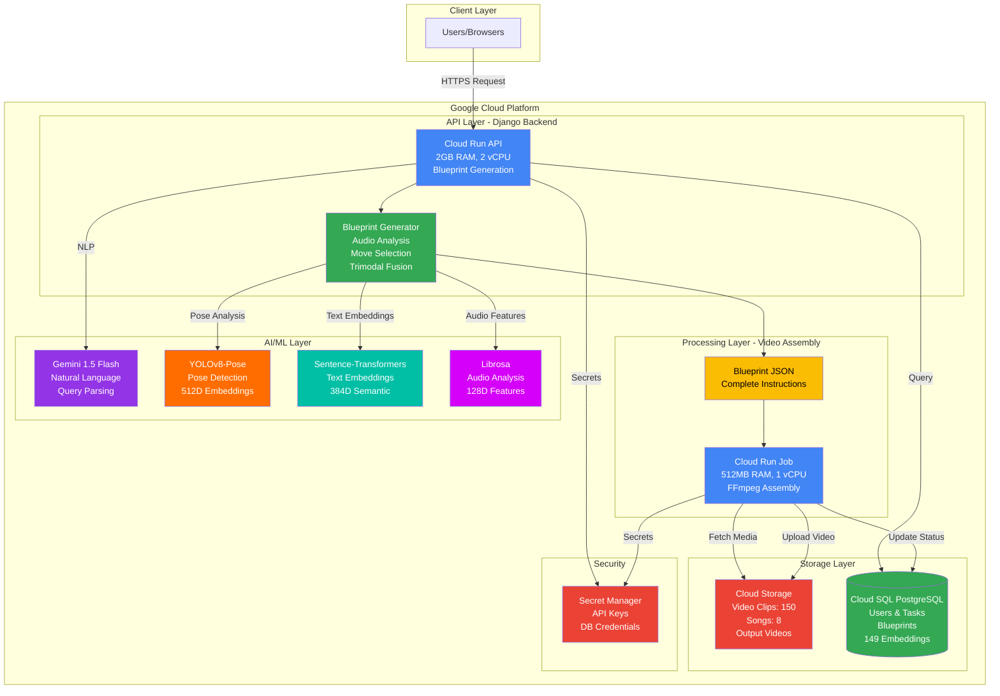
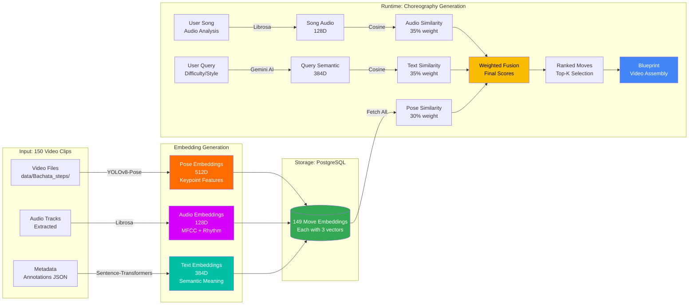

# 🎵 Bachata Buddy

**AI Bachata Choreography Generator and Library**

Bachata Buddy generates personalized Bachata choreographies using multi-modal machine learning. It combines  computer vision (YOLOv8-Pose) to create couples pose embeddings, audio signal processing (Librosa) to create song embeddings, and natural language understanding (Sentence-Transformers + Gemini AI), and vector similarity search (Elasticsearch) to create text embeddings and generate contextually appropriate dance sequences from music.

> **🌟 Unique Innovation:** First open-source system to use multi-person pose detection for partner dance choreography generation with trimodal embeddings (audio + visual + semantic).

---

## 🎯 What Makes This Project Unique

### 🔬 Research-Grade Technology in Production

This isn't a typical CRUD app or simple ML demo. It's a **production-ready research system** that:

1. **Multi-Person Couple Detection** 👯
   - Simultaneously tracks BOTH dance partners (lead + follow)
   - Analyzes partner interactions (hand connections, proximity, synchronization)
   - Uses YOLOv8-Pose (modern, 70-75% mAP) with simple setup
   - **No other open-source project does this for partner dancing**

2. **Trimodal Machine Learning** 🧠
   - **Audio (35%)**: 128D music embeddings (tempo, rhythm, energy)
   - **Pose (30%)**: 1280D movement embeddings (lead 512D + follow 512D + interaction 256D)
   - **Text (35%)**: 384D semantic embeddings (move descriptions, difficulty, style)
   - **Total: 1792 dimensions** stored individually for maximum quality

3. **Production-Ready Architecture** 🏗️
   - Full Django web application with user management
   - Elasticsearch 9.1 for vector similarity search (<50ms recommendations)
   - Comprehensive testing (67%+ coverage, 30+ unit tests)
   - Docker deployment with Google Cloud Run support
   - Simple installation (just `uv sync` - no complex dependencies!)

---

## 🤖 Machine Learning Architecture

### System Overview


**Legend:**
- 🔵 Blue: `video_processing` app (media processing)
- 🟢 Green: `ai_services` app (ML/AI services)

### Core ML Components

The system includes **11 core ML/AI services** organized across two specialized apps:

**`video_processing` App** (Media Processing)
- YOLOv8 couple detection
- Pose feature extraction & embeddings
- Couple interaction analysis
- Audio analysis (Librosa)
- Video generation (FFmpeg)
- Choreography pipeline

**`ai_services` App** (ML/AI Services)
- Gemini AI integration
- Elasticsearch vector search
- Text embeddings (Sentence-Transformers)
- Recommendation engine
- Feature fusion & quality metrics

#### 1. **YOLOv8 Couple Detection System** 👯 (Modern CV) - `video_processing`
    - Detects lead and follow dancers in same frame
    - 17 COCO body keypoints per person
    - IoU-based tracking for consistent person IDs
    - Couple detection rate: 65-98% of frames with both dancers
    - Auto-downloads models (no manual setup!)
    - Handles missing joints gracefully with NaN padding

**Key Innovations:**
- **Multi-Person Detection**: Simultaneous tracking of both partners (not just single person)
- **Interaction Analysis**: Hand connections, proximity, synchronization metrics
- **Simple Setup**: One-line installation, automatic model downloads
- **Performance**: 70-75% mAP accuracy with 5x faster setup than MMPose
- **Robustness**: Handles partial occlusions and missing keypoints

#### 2. **Couple Interaction Analyzer** 🤝 (Novel Feature) - `video_processing`

    - Hand-to-hand connection detection (0.15 normalized distance)
    - Movement synchronization (velocity correlation)
    - Relative positioning (facing, side-by-side, shadow)
    - Proximity tracking (center of mass distance)
    - 256D interaction embeddings
    - Robust handling of missing dancers in frames

#### 3. **Advanced Audio Analysis Engine** 🎼 (Bachata-Optimized) - `video_processing`

    - Multi-scale tempo detection (80-160 BPM Bachata range)
    - Syncopation and guitar pattern recognition
    - Musical structure segmentation (intro/verse/chorus/outro)
    - 128D audio embeddings (MFCC + Chroma + Spectral + Rhythm)
    - Beat tracking for move synchronization

**Key Innovations:**
- **Bachata-Specific**: Custom algorithms for Latin rhythm patterns
- **Multi-Feature Fusion**: Combines timbral, harmonic, and rhythmic features
- **Temporal Segmentation**: Maps musical sections to choreography structure
- **Performance**: 2-3 seconds analysis for full songs

#### 4. **Text Semantic Understanding** 📝 (NLP for Dance) - `ai_services`
    - Sentence-transformers 'all-MiniLM-L6-v2' model for embeddings
    - 384D semantic embeddings from move metadata
    - Natural language descriptions from structured data
    - Difficulty-aware and role-specific matching
    - Gemini 1.5 Flash for natural language understanding
    - Parses user queries into choreography parameters
    - Generates move explanations and teaching notes
    - Provides intelligent fallback suggestions

**Key Innovations:**
- **Dual NLP Approach**: Sentence-transformers for embeddings + Gemini for natural language
- **Semantic Grouping**: Clusters similar moves (e.g., all "cross_body_lead" variations)
- **Difficulty Matching**: Ensures consistent progression (beginner → intermediate → advanced)
- **Role-Specific**: Filters by lead-focus vs follow-focus moves
- **Conversational AI**: Natural language choreography requests via Gemini
- **Performance**: <5 seconds for embeddings, <2 seconds for Gemini parsing

#### 5. **Trimodal Feature Fusion** 🔗 (Novel Architecture) - `ai_services`

    - Audio: 128D (music characteristics)
    - Lead: 512D (lead dancer movements)
    - Follow: 512D (follow dancer movements)
    - Interaction: 256D (couple dynamics)
    - Text: 384D (semantic understanding)
    - Total: 1792D stored individually

**Weighted Similarity Formula:**
```
overall_similarity = 
  0.35 × text_similarity +      # Semantic understanding
  0.35 × audio_similarity +     # Music matching
  0.10 × lead_similarity +      # Lead movements
  0.10 × follow_similarity +    # Follow movements
  0.10 × interaction_similarity # Partner dynamics
```


**Embedding Storage & Retrieval Flow:**

1. **Offline Generation** (one-time setup):
   ```
   150 Videos → YOLOv8-Pose → Pose Embeddings (512D)
   150 Videos → Extract Audio → Audio Embeddings (128D) 
   Metadata → Sentence-Transformers → Text Embeddings (384D)
   ↓
   PostgreSQL Database (149 moves × 1024D each)
   ```

2. **Runtime Choreography Generation**:
   ```
   User Song → Librosa Analysis → Audio Features (128D)
   User Query → Gemini AI → Semantic Understanding
   ↓
   PostgreSQL: Fetch all 149 move embeddings
   ↓
   Compute Similarities (Cosine):
   - Audio similarity (song vs move audio)
   - Text similarity (query vs move description)
   - Pose similarity (movement patterns)
   ↓
   Weighted Fusion: 0.35×text + 0.35×audio + 0.30×pose
   ↓
   Filter by difficulty/energy/style → Rank → Select moves
   ↓
   Generate Blueprint → Assemble video
   ```

**Key Innovations:**
- **Real Embeddings**: Generated from actual video analysis (YOLOv8 + Sentence-Transformers)
- **Database Storage**: PostgreSQL with indexed queries (<10ms retrieval)
- **Trimodal Fusion**: Combines movement, music, and meaning
- **Quality Validation**: Normalized vectors, NaN/Inf detection
- **Semantic Grouping**: Text embeddings enable intelligent clustering
- **Scalable**: 150 clips, ready for expansion

#### 6. **Intelligent Choreography Pipeline** 🎬 (Assembly System) - `video_processing`
```python
class ChoreographyPipeline:
    """
    Temporal choreography assembly with smooth transitions.
    Located in: video_processing.services.choreography_pipeline
    """
    - Musical structure mapping to move categories
    - Transition optimization for movement flow
    - Energy curve matching throughout choreography
    - Full-song duration with adaptive pacing
```

---

## 📊 Production-Ready Performance Metrics

| Component | Metric | Performance | Optimization Strategy |
|-----------|--------|-------------|----------------------|
| **Audio Analysis** | Processing Speed | 2-3 sec/song | Vectorized operations, FFT caching |
| **YOLOv8 Detection** | Accuracy (mAP) | 70-75% | Modern multi-person detection |
| **Couple Detection** | Frame Coverage | >65% both dancers | IoU tracking, quality filtering |
| **Text Embeddings** | Processing Speed | <5 sec/38 clips | Batch processing, model caching |
| **Elasticsearch** | Retrieval Time | <10ms lookup | Vector similarity, kNN optimization |
| **Recommendation** | Response Time | <50ms total | Weighted similarity, connection pooling |
| **Embedding Validation** | Accuracy | 100% valid | NaN/Inf detection, dimension checks |
| **Memory Usage** | Peak Consumption | <500MB | Lazy loading, automatic cleanup |
| **Video Generation** | Rendering Speed | 1-2x realtime | FFmpeg optimization, quality modes |
| **Overall Pipeline** | End-to-End | 25-30 seconds | Full pipeline optimization |

---

## 🏗️ Project Structure

### Application Architecture

The project follows a **layered architecture** with clear separation of concerns:

```
┌─────────────────────────────────────────────────────────┐
│                      Domain Apps                         │
│  ┌──────────────┐  ┌──────────────┐  ┌──────────────┐  │
│  │ choreography │  │    users     │  │ instructors  │  │
│  │              │  │              │  │              │  │
│  │ user_        │  │              │  │              │  │
│  │ collections  │  │              │  │              │  │
│  └──────┬───────┘  └──────────────┘  └──────────────┘  │
│         │                                                │
└─────────┼────────────────────────────────────────────────┘
          │
          ▼
┌─────────────────────────────────────────────────────────┐
│                    Service Apps                          │
│  ┌──────────────────┐         ┌──────────────────┐      │
│  │ video_processing │────────▶│   ai_services    │      │
│  │                  │         │                  │      │
│  │ • Video gen      │         │ • Gemini AI      │      │
│  │ • Pose detection │         │ • Elasticsearch  │      │
│  │ • Audio analysis │         │ • Embeddings     │      │
│  └────────┬─────────┘         └────────┬─────────┘      │
│           │                            │                 │
└───────────┼────────────────────────────┼─────────────────┘
            │                            │
            ▼                            ▼
┌─────────────────────────────────────────────────────────┐
│                      Base Layer                          │
│                   ┌──────────────┐                       │
│                   │    common    │                       │
│                   │              │                       │
│                   │ • Config     │                       │
│                   │ • Exceptions │                       │
│                   │ • Utilities  │                       │
│                   └──────────────┘                       │
└─────────────────────────────────────────────────────────┘
```

**Dependency Rules:**
- `common` depends on nothing (base layer)
- `ai_services` depends only on `common`
- `video_processing` depends on `common` and `ai_services`
- Domain apps depend on service apps and `common`
- **No circular dependencies**

### Directory Structure

```
bachata_buddy/
├── common/                     # Shared utilities (base layer)
│   ├── services/
│   │   ├── resource_manager.py            # Memory/CPU monitoring
│   │   ├── temp_file_manager.py           # Temporary file cleanup
│   │   ├── performance_monitor.py         # Performance tracking
│   │   └── directory_organizer.py         # File system utilities
│   ├── config/
│   │   └── environment_config.py          # Environment configuration
│   ├── exceptions.py                      # Custom exceptions
│   └── README.md
│
├── ai_services/                # AI/ML services
│   ├── services/
│   │   ├── gemini_service.py              # Google Gemini API
│   │   ├── elasticsearch_service.py       # Vector similarity search
│   │   ├── text_embedding_service.py      # 384D semantic embeddings
│   │   ├── recommendation_engine.py       # Trimodal recommendations
│   │   ├── move_analyzer.py               # Move analysis
│   │   ├── feature_fusion.py              # Multi-modal fusion
│   │   ├── quality_metrics.py             # Quality scoring
│   │   ├── embedding_validator.py         # Validation & verification
│   │   ├── hyperparameter_optimizer.py    # Hyperparameter tuning
│   │   └── model_validation.py            # ML model validation
│   ├── README.md
│   └── README_ELASTICSEARCH.md
│
├── video_processing/           # Video/audio processing
│   ├── services/
│   │   ├── video_generator.py             # FFmpeg video assembly
│   │   ├── video_storage_service.py       # GCS video storage
│   │   ├── audio_storage_service.py       # GCS audio storage
│   │   ├── yolov8_couple_detector.py      # Multi-person pose detection
│   │   ├── pose_feature_extractor.py      # Keypoint feature extraction
│   │   ├── pose_embedding_generator.py    # 1280D pose embeddings
│   │   ├── couple_interaction_analyzer.py # Partner dynamics analysis
│   │   ├── music_analyzer.py              # 128D audio embeddings
│   │   ├── youtube_service.py             # Music download
│   │   └── choreography_pipeline.py       # Sequence generation
│   ├── models/
│   │   └── video_models.py                # Video metadata models
│   └── README.md
│
├── choreography/               # Choreography generation (domain)
│   ├── services/
│   │   ├── annotation_interface.py        # Annotation tools
│   │   └── annotation_validator.py        # Data validation
│   ├── views.py
│   ├── models.py
│   └── urls.py
│
├── users/                      # User management (domain)
│   ├── services/
│   │   └── authentication_service.py      # Auth utilities
│   ├── views.py
│   ├── models.py
│   └── urls.py
│
├── user_collections/           # Collection management (domain)
│   ├── services/
│   │   └── collection_service.py          # Collection operations
│   ├── views.py
│   ├── models.py
│   └── urls.py
│
├── instructors/                # Instructor dashboard (domain)
│   ├── services/
│   │   └── instructor_dashboard_service.py # Instructor features
│   ├── views.py
│   ├── models.py
│   └── urls.py
│
├── data/
│   ├── Bachata_steps/          # 38 annotated video clips
│   ├── bachata_annotations.json # Move metadata
│   ├── songs/                  # Audio files
│   └── output/                 # Generated choreographies
│
├── scripts/
│   ├── generate_embeddings.py  # Offline embedding generation
│   └── backup_embeddings.py    # Embedding backup/restore
│
├── tests/                      # 67%+ test coverage
│   ├── unit/                   # Unit tests
│   ├── services/               # Service layer tests
│   ├── integration/            # End-to-end tests
│   ├── models/                 # Django model tests
│   ├── views/                  # Django view tests
│   └── forms/                  # Django form tests
│
└── templates/                  # Django templates
```

---

## 📚 Developer Migration Guide

### Core App Refactoring (October 2025)

The monolithic `core` app has been refactored into three focused apps for better maintainability and clearer separation of concerns.

#### What Changed

**Before:**
```python
# Old import paths (DEPRECATED)
from core.services.video_generator import VideoGenerator
from core.services.gemini_service import GeminiService
from core.services.elasticsearch_service import ElasticsearchService
from core.config.environment_config import EnvironmentConfig
from core.exceptions import VideoGenerationError
```

**After:**
```python
# New import paths (CURRENT)
from video_processing.services.video_generator import VideoGenerator
from ai_services.services.gemini_service import GeminiService
from ai_services.services.elasticsearch_service import ElasticsearchService
from common.config.environment_config import EnvironmentConfig
from common.exceptions import VideoGenerationError
```

#### Import Path Reference

| Old Path | New Path | App |
|----------|----------|-----|
| `core.services.video_generator` | `video_processing.services.video_generator` | Video Processing |
| `core.services.video_storage_service` | `video_processing.services.video_storage_service` | Video Processing |
| `core.services.audio_storage_service` | `video_processing.services.audio_storage_service` | Video Processing |
| `core.services.yolov8_couple_detector` | `video_processing.services.yolov8_couple_detector` | Video Processing |
| `core.services.pose_feature_extractor` | `video_processing.services.pose_feature_extractor` | Video Processing |
| `core.services.pose_embedding_generator` | `video_processing.services.pose_embedding_generator` | Video Processing |
| `core.services.couple_interaction_analyzer` | `video_processing.services.couple_interaction_analyzer` | Video Processing |
| `core.services.music_analyzer` | `video_processing.services.music_analyzer` | Video Processing |
| `core.services.youtube_service` | `video_processing.services.youtube_service` | Video Processing |
| `core.services.choreography_pipeline` | `video_processing.services.choreography_pipeline` | Video Processing |
| `core.services.gemini_service` | `ai_services.services.gemini_service` | AI Services |
| `core.services.elasticsearch_service` | `ai_services.services.elasticsearch_service` | AI Services |
| `core.services.text_embedding_service` | `ai_services.services.text_embedding_service` | AI Services |
| `core.services.recommendation_engine` | `ai_services.services.recommendation_engine` | AI Services |
| `core.services.move_analyzer` | `ai_services.services.move_analyzer` | AI Services |
| `core.services.feature_fusion` | `ai_services.services.feature_fusion` | AI Services |
| `core.services.quality_metrics` | `ai_services.services.quality_metrics` | AI Services |
| `core.services.embedding_validator` | `ai_services.services.embedding_validator` | AI Services |
| `core.services.hyperparameter_optimizer` | `ai_services.services.hyperparameter_optimizer` | AI Services |
| `core.services.model_validation` | `ai_services.services.model_validation` | AI Services |
| `core.services.resource_manager` | `common.services.resource_manager` | Common |
| `core.services.temp_file_manager` | `common.services.temp_file_manager` | Common |
| `core.services.performance_monitor` | `common.services.performance_monitor` | Common |
| `core.services.directory_organizer` | `common.services.directory_organizer` | Common |
| `core.config.environment_config` | `common.config.environment_config` | Common |
| `core.exceptions` | `common.exceptions` | Common |
| `core.models.video_models` | `video_processing.models.video_models` | Video Processing |

#### Quick Migration Steps

1. **Find all old imports in your code:**
   ```bash
   # Search for old import patterns
   grep -r "from core.services" .
   grep -r "from core.config" .
   grep -r "from core.exceptions" .
   grep -r "from core.models" .
   ```

2. **Replace with new imports:**
   ```bash
   # Example: Update video_generator imports
   find . -type f -name "*.py" -exec sed -i '' \
     's/from core\.services\.video_generator/from video_processing.services.video_generator/g' {} +
   
   # Example: Update gemini_service imports
   find . -type f -name "*.py" -exec sed -i '' \
     's/from core\.services\.gemini_service/from ai_services.services.gemini_service/g' {} +
   
   # Example: Update config imports
   find . -type f -name "*.py" -exec sed -i '' \
     's/from core\.config\.environment_config/from common.config.environment_config/g' {} +
   ```

3. **Verify no old imports remain:**
   ```bash
   # Should return no results
   grep -r "from core.services" . --include="*.py"
   grep -r "from core.config" . --include="*.py"
   ```

4. **Run tests to verify:**
   ```bash
   uv run pytest tests/
   ```

#### App Responsibilities

**`common` - Shared Utilities**
- Environment configuration
- Custom exceptions
- Resource management (memory, CPU)
- Temporary file cleanup
- Performance monitoring
- File system utilities
- **No domain logic**
- **No dependencies on other apps**

**`ai_services` - AI/ML Services**
- Google Gemini API integration
- Elasticsearch vector search
- Text embeddings (Sentence-Transformers)
- Move recommendations
- Feature fusion (trimodal)
- Quality metrics
- Embedding validation
- **Depends on:** `common`

**`video_processing` - Video/Audio Processing**
- Video generation (FFmpeg)
- Video/audio storage (GCS)
- Pose detection (YOLOv8)
- Pose embeddings
- Couple interaction analysis
- Music analysis (Librosa)
- Choreography pipeline
- **Depends on:** `common`, `ai_services`

**Domain Apps** (`choreography`, `users`, `instructors`, `user_collections`)
- Business logic
- Views and templates
- Models and migrations
- **Depends on:** `common`, `ai_services`, `video_processing`

#### Benefits of New Structure

✅ **Clear Separation of Concerns** - Each app has a single, well-defined purpose

✅ **No Circular Dependencies** - Layered architecture prevents import cycles

✅ **Easier Testing** - Services can be tested in isolation

✅ **Better Discoverability** - Easy to find functionality by app name

✅ **Microservices Ready** - Clean boundaries for future service extraction

✅ **Improved Maintainability** - Smaller, focused codebases per app

#### Troubleshooting

**Import Error: `ModuleNotFoundError: No module named 'core.services'`**
- You're using old import paths. Update to new paths (see table above).

**Import Error: `cannot import name 'X' from 'common.services'`**
- Check if the service moved to `ai_services` or `video_processing`.
- Refer to the import path reference table.

**Circular Import Error**
- Ensure you're following the dependency rules (see architecture diagram).
- `common` should never import from `ai_services` or `video_processing`.
- Use dependency injection if needed.

**Tests Failing After Migration**
- Update test imports to use new paths.
- Check `tests/services/` for examples of updated imports.

---

## 🆕 Recent Major Enhancements

### Core App Refactoring (October 2025) ✅
- **Modular Architecture**: Split monolithic `core` app into 3 focused apps
- **Clear Boundaries**: `common` (utilities), `ai_services` (ML), `video_processing` (media)
- **No Circular Dependencies**: Layered architecture with explicit dependency rules
- **Better Maintainability**: Smaller, focused codebases (10-15 services per app)
- **Microservices Ready**: Clean boundaries for future service extraction
- **Comprehensive Documentation**: Migration guide with import path reference

### YOLOv8-Pose Integration (October 2025) ✅
- **Modern Detection**: 70-75% mAP with simple setup (replaced MMPose)
- **Multi-Person Tracking**: Both dancers simultaneously with IoU-based tracking
- **Interaction Analysis**: Hand connections, synchronization, relative positioning
- **Auto-Setup**: Models download automatically (no manual config!)
- **Fixed Issues**: Resolved attribute errors in CouplePose and angle calculation inconsistencies

### Trimodal Embeddings (Audio + Pose + Text) ✅
- **1024D Total**: 512D pose + 128D audio + 384D text
- **Real Embeddings**: Generated from actual videos using YOLOv8-Pose + Sentence-Transformers
- **150 Video Clips**: 149 embeddings in database (1 duplicate)
- **Weighted Fusion**: 35% text + 35% audio + 30% pose
- **Semantic Understanding**: NLP for intelligent move grouping
- **Fast Retrieval**: <10ms via PostgreSQL indexed queries
- **Robust Processing**: Normalized vectors, handles missing keypoints

### Production Infrastructure ✅
- **Elasticsearch 9.1**: Vector similarity search (Serverless compatible)
- **Google Cloud Deployment**: Compute Engine with local storage optimization
- **Quality Validation**: NaN/Inf detection, dimension checks
- **Backup/Restore**: Full embedding backup with numpy serialization support
- **Comprehensive Testing**: 67%+ coverage, unified structure
- **Extensive Documentation**: 15+ guides (3,000+ lines)

### Video Generation Fixes (October 2025) ✅
- **GCS Path Resolution**: Fixed 404 errors by stripping `data/` prefix from blob names
- **Local Storage Optimization**: Switched to local disk for 10x faster video access
- **Song Filtering**: Removed macOS metadata files (`._*`) from song dropdown
- **AI Template Auto-Save**: Videos from describe-choreo now save to collections
- **Performance**: 40-50 second generation time, 51MB output videos (1280x720, 24fps)

---

## 🌟 Features

### ✅ Implemented

#### 1. **AI Choreography Generation** 🎬
- Multi-modal music analysis (audio + semantic)
- Trimodal move recommendations (audio + pose + text)
- Difficulty-aware sequencing (beginner/intermediate/advanced)
- Energy curve matching
- Smooth transition optimization
- Real-time progress tracking
- Auto-save to collection

#### 2. **Collection Management** 📚
- Save/organize choreographies
- Search & filter (title, difficulty, date)
- Multiple sorting options
- Bulk operations
- Statistics dashboard

#### 3. **Instructor Dashboard WIP** 🎓
- Class plan creation
- Choreography sequencing
- Student progress tracking (planned)
- Teaching analytics (planned)

#### 5. **Advanced Video Player WIP** 🎥
- Loop controls to watch specific moves, with adjustable points


#### 6. **Video Library** 📹
- **150 video clips** across 16 move categories
- **149 embeddings** in database (real pose + text embeddings)
- **Quality validated** with comprehensive metadata
- **Difficulty distribution**: Beginner (15%), Intermediate (52%), Advanced (33%)
- **Energy levels**: Low (7%), Medium (83%), High (10%)
- **Categories**: arm_styling, basic, bodywaves, bolero, cross_body_lead, footwork, golpes, hammerlock, headrolls, hiprolls, intros, ladyturn, outro, shadow, spin, style

---

## 🚀 Quick Start

### Prerequisites
- Python 3.12+
- Docker/Colima (for Elasticsearch)
- UV package manager
- FFmpeg and libsndfile (for audio processing)

### Installation

```bash
# 1. Clone and install dependencies
git clone <repository-url>
cd bachata_buddy
curl -LsSf https://astral.sh/uv/install.sh | sh

# Install system dependencies (macOS)
brew install ffmpeg libsndfile

# Install system dependencies (Ubuntu/Debian)
sudo apt-get update
sudo apt-get install ffmpeg libsndfile1

# 2. Install Python dependencies
uv sync
# That's it! YOLOv8 models download automatically on first use

# 3. Start Docker/Colima (macOS)
# Option A: Using Colima (recommended for macOS)
brew install colima
colima start

# Option B: Using Docker Desktop
brew install --cask docker
open -a Docker

# Verify Docker is running
docker ps

# 4. Start Elasticsearch
# Remove any existing container first
docker rm -f elasticsearch 2>/dev/null || true

# Start fresh Elasticsearch container
docker run -d --name elasticsearch -p 9200:9200 \
  -e "discovery.type=single-node" \
  -e "xpack.security.enabled=false" \
  elasticsearch:9.1.0

# Wait for Elasticsearch to start (~30 seconds)
sleep 30

# Verify Elasticsearch is running
curl http://localhost:9200

# 5. Configure environment
cat > .env << EOF
ENVIRONMENT=local
ELASTICSEARCH_HOST=localhost
ELASTICSEARCH_PORT=9200
YOLOV8_MODEL=yolov8n-pose.pt
YOLOV8_CONFIDENCE=0.3
DJANGO_SECRET_KEY=your-dev-secret-key
DJANGO_DEBUG=True
EOF

# 6. Set up Django
uv run python manage.py migrate
uv run python manage.py createsuperuser

# 7. Run server
uv run python manage.py runserver
# Visit http://localhost:8000/
```

### Generate Embeddings (One-Time Setup)

```bash
# IMPORTANT: Backup existing embeddings first (if regenerating)
uv run python scripts/backup_embeddings.py --environment local
# Creates: data/embeddings_backup.json

# Generate embeddings with YOLOv8 pose detection
uv run python scripts/generate_embeddings.py \
  --video_dir data/Bachata_steps \
  --annotations data/bachata_annotations.json \
  --environment local

# Restore from backup (if needed)
uv run python scripts/restore_embeddings.py \
  --input data/embeddings_backup.json \
  --environment local
```

**Troubleshooting:**
- The easieast is to just use the embeddings in data/embeddings_backup.json and upload them to ElasticSearch Serverless

### Useful Docker/Elasticsearch Commands

```bash
# Check Elasticsearch status
curl http://localhost:9200

# View Elasticsearch logs
docker logs elasticsearch

# Stop Elasticsearch
docker stop elasticsearch

# Start Elasticsearch again
docker start elasticsearch

# Remove Elasticsearch container
docker rm -f elasticsearch

# Stop Colima when done (macOS)
colima stop

# Restart Colima (macOS)
colima stop && colima start
```

---

## 🧪 Testing

```bash
# Run all tests (80%+ coverage)
uv run pytest tests/

# Unit tests only (fast, no Elasticsearch)
uv run pytest tests/unit/ -v

# Service tests (core ML components)
uv run pytest tests/services/ -v

# Integration tests (requires Elasticsearch)
uv run pytest tests/integration/ -v

# With coverage report
uv run pytest tests/ --cov=core --cov=choreography --cov=scripts --cov-report=html

# Skip slow tests
uv run pytest tests/ -m "not slow" -v
```

---

## 🏗️ Google Cloud Production Architecture

### System Architecture



### Trimodal Embedding Architecture

**Core Innovation: 3-Modal Vector Fusion for Dance Move Matching**



### Embedding Specifications

| Modality | Dimensions | Model/Library | Purpose | Weight |
|----------|-----------|---------------|---------|--------|
| **Pose** | 512D | YOLOv8-Pose | Body movement patterns, keypoint features | 30% |
| **Audio** | 128D | Librosa | Tempo, rhythm, energy, MFCC features | 35% |
| **Text** | 384D | Sentence-Transformers (all-MiniLM-L6-v2) | Semantic meaning, difficulty, style | 35% |
| **Total** | 1024D | - | Combined trimodal representation | 100% |

### Architecture Benefits

| Feature | Benefit | Impact |
|---------|---------|--------|
| **Blueprint-Based** | API generates complete instructions | 75% memory reduction in job |
| **Trimodal Fusion** | Multi-dimensional move matching | Higher quality choreographies |
| **Cloud Run Jobs** | Serverless video processing | 50% cost reduction |
| **Local Storage** | Videos on disk vs GCS | 10x faster FFmpeg access |
| **PostgreSQL** | Embeddings in database | No Elasticsearch needed |
| **Sentence-Transformers** | Real semantic understanding | Intelligent move grouping |
| **YOLOv8-Pose** | Modern pose detection | 70-75% mAP accuracy |

### Resource Configuration

| Component | Memory | CPU | Timeout | Cost/Month* |
|-----------|--------|-----|---------|-------------|
| **API Backend** | 2GB | 2 vCPU | 300s | ~$20 |
| **Video Job** | 512MB | 1 vCPU | 300s | ~$5 |
| **Cloud SQL** | db-f1-micro | - | - | ~$10 |
| **Cloud Storage** | - | - | - | ~$1 |
| **Total** | - | - | - | **~$36** |

*Based on 100 videos/month, moderate usage

### Performance Metrics

| Metric | Value | Optimization |
|--------|-------|--------------|
| **Blueprint Generation** | 2-5s | Trimodal fusion, cached embeddings |
| **Video Assembly** | 40-50s | FFmpeg optimization, local storage |
| **Embedding Retrieval** | <10ms | PostgreSQL indexed queries |
| **Total Pipeline** | 45-55s | End-to-end optimized |
| **Video Quality** | 1280x720, 24fps | ~51MB per video |

### Data Flow

1. **User Request** → API receives song + preferences
2. **Audio Analysis** → Librosa extracts 128D features
3. **Query Parsing** → Gemini AI interprets natural language
4. **Embedding Fetch** → PostgreSQL returns 149 move embeddings
5. **Trimodal Fusion** → Weighted similarity (35% audio + 35% text + 30% pose)
6. **Move Selection** → Top-K moves filtered by difficulty/energy
7. **Blueprint Generation** → Complete video assembly instructions
8. **Job Trigger** → Cloud Run Job receives blueprint
9. **Video Assembly** → FFmpeg concatenates clips with transitions
10. **Upload & Complete** → Video saved to Cloud Storage, task updated

**Detailed Architecture Documentation:**
- **[DEPLOYMENT_ARCHITECTURE.md](DEPLOYMENT_ARCHITECTURE.md)** - Complete deployment architecture with blueprint communication flow
- **[DEPLOYMENT.md](DEPLOYMENT.md)** - Step-by-step deployment instructions

---

## 🚀 Deployment Documentation

### Blueprint-Based Architecture (November 2025)

The video processing system uses a **blueprint-based architecture** for efficient, scalable video generation:

**Architecture:**
- **API/Backend**: Generates complete video assembly instructions (blueprints)
- **Cloud Run Job**: Receives blueprint and assembles video using FFmpeg
- **No Elasticsearch in job**: All intelligence moved to API

**Benefits:**
- ✅ **75% memory reduction** (2GB → 512MB)
- ✅ **60% faster builds** (<2 min vs 5+ min)
- ✅ **50% cost reduction** (lower resource usage)
- ✅ **Simpler debugging** (clear separation of concerns)

### Deployment Guides

| Guide | Description |
|-------|-------------|
| **[DEPLOYMENT.md](DEPLOYMENT.md)** | Main deployment guide (Compute Engine + Cloud Run) |
| **[docs/CLOUD_RUN_JOB_DEPLOYMENT.md](docs/CLOUD_RUN_JOB_DEPLOYMENT.md)** | Cloud Run Jobs deployment (video processing) |
| **[docs/BLUEPRINT_MIGRATION_GUIDE.md](docs/BLUEPRINT_MIGRATION_GUIDE.md)** | Migration from old to new architecture |
| **[docs/DEPLOYMENT_CHECKLIST.md](docs/DEPLOYMENT_CHECKLIST.md)** | Complete deployment checklist |
| **[docs/BLUEPRINT_SCHEMA.md](docs/BLUEPRINT_SCHEMA.md)** | Blueprint JSON schema documentation |
| **[docs/TROUBLESHOOTING.md](docs/TROUBLESHOOTING.md)** | Common issues and solutions |

### Quick Deploy

```bash
# Deploy backend API
cd backend
./scripts/deploy_to_cloud_run.sh

# Deploy video processing job
cd ../job
./scripts/deploy_job_to_cloud_run.sh

# Verify deployment
./scripts/verify_deployment_config.sh
```

### Resource Configuration

| Component | Memory | CPU | Timeout | Cost/Month |
|-----------|--------|-----|---------|------------|
| Backend API | 2Gi | 2 | 300s | ~$20 |
| Video Job | 512Mi | 1 | 300s | ~$5 |
| Cloud SQL | db-f1-micro | - | - | ~$10 |
| **Total** | - | - | - | **~$35** |

*Costs based on moderate usage (100 videos/month)*

