# 🎵 Bachata Buddy

**AI-Powered Bachata Choreography Generator**

Bachata Buddy generates personalized Bachata choreographies using AI and music analysis. It combines audio signal processing (Librosa), OpenAI for natural language understanding, and intelligent move selection to create contextually appropriate dance sequences from music.

---

## 🎯 What This Project Does

### Core Features

1. **AI Choreography Generation** 🤖
   - Natural language choreography requests ("Create a romantic beginner dance")
   - OpenAI GPT-4 for parameter extraction and understanding
   - Autonomous agent orchestration with function calling
   - Real-time reasoning panel showing agent decision-making

2. **Music Analysis** 🎼
   - Audio feature extraction with Librosa
   - Tempo, rhythm, and energy detection
   - Automatic song metadata extraction

3. **Video Assembly** 🎬
   - FFmpeg-based video concatenation
   - Automatic audio synchronization
   - Progress tracking and status updates

4. **Collection Management** 📚
   - Save and organize choreographies
   - Search and filter by difficulty, style, date
   - User-specific collections

---

## 🏗️ Architecture

### Technology Stack

**Backend:**
- Django 5.2 + Django REST Framework
- PostgreSQL 15+ (database)
- OpenAI GPT-4 (AI orchestration)
- Librosa (audio analysis)
- FFmpeg (video processing)
- UV package manager (Python dependencies)

**Frontend:**
- React + Vite
- TypeScript
- Tailwind CSS

**Infrastructure:**
- Docker + Docker Compose (local development)
- AWS-ready (App Runner, RDS, S3)

### System Architecture

```
┌─────────────────────────────────────────────────────────┐
│                      User Interface                      │
│                   React Frontend (Port 3000)             │
└────────────────────────┬────────────────────────────────┘
                         │ HTTP/REST API
                         ▼
┌─────────────────────────────────────────────────────────┐
│                   Django Backend (Port 8000)             │
│                                                          │
│  ┌──────────────┐  ┌──────────────┐  ┌──────────────┐  │
│  │    Agent     │  │  Blueprint   │  │    Video     │  │
│  │   Service    │  │  Generator   │  │   Assembly   │  │
│  │   (OpenAI)   │  │  (Librosa)   │  │   (FFmpeg)   │  │
│  └──────────────┘  └──────────────┘  └──────────────┘  │
│                                                          │
└────────────────────────┬────────────────────────────────┘
                         │
                         ▼
┌─────────────────────────────────────────────────────────┐
│                   PostgreSQL Database                    │
│         (Users, Tasks, Songs, Choreographies)            │
└─────────────────────────────────────────────────────────┘
```

### Data Flow

1. **User Request** → User describes choreography in natural language
2. **AI Processing** → OpenAI extracts parameters (difficulty, style, energy)
3. **Music Analysis** → Librosa analyzes audio features
4. **Move Selection** → System selects appropriate dance moves
5. **Blueprint Generation** → Creates video assembly instructions
6. **Video Assembly** → FFmpeg concatenates clips and adds audio
7. **Result** → User receives choreography video

### Trimodal Embedding Fusion

The system uses a trimodal embedding approach to match dance moves with music and user intent. Each move is represented by three embedding types that are fused for similarity search:

```mermaid
flowchart TB
    subgraph Input["📥 Input Sources"]
        VIDEO["🎬 Dance Video<br/>(Lead + Follow poses)"]
        AUDIO["🎵 Audio Track<br/>(Music features)"]
        TEXT["📝 Move Description<br/>(Style, difficulty)"]
    end

    subgraph Encoders["🔧 Embedding Encoders"]
        POSE_ENC["Pose Encoder<br/>(YOLOv8 Pose)"]
        AUDIO_ENC["Audio Encoder<br/>(Librosa MFCCs)"]
        TEXT_ENC["Text Encoder<br/>(Sentence Transformers)"]
    end

    subgraph Embeddings["📊 Raw Embeddings"]
        POSE_EMB["Pose Embedding<br/>512 dimensions<br/>(256 lead + 256 follow)"]
        AUDIO_EMB["Audio Embedding<br/>128 dimensions"]
        TEXT_EMB["Text Embedding<br/>384 dimensions"]
    end

    subgraph Normalization["⚖️ Weighted Normalization"]
        NORM["L2 Normalize<br/>+ Apply Weights"]
        W1["Pose: 35%"]
        W2["Audio: 35%"]
        W3["Text: 30%"]
    end

    subgraph Fusion["🔗 Embedding Fusion"]
        CONCAT["Concatenate<br/>Weighted Vectors"]
        COMBINED["Combined Embedding<br/>1024 dimensions"]
    end

    subgraph Search["🔍 Vector Search"]
        FAISS["FAISS Index<br/>(IndexFlatIP)"]
        RESULTS["Top-K Similar Moves"]
    end

    VIDEO --> POSE_ENC
    AUDIO --> AUDIO_ENC
    TEXT --> TEXT_ENC

    POSE_ENC --> POSE_EMB
    AUDIO_ENC --> AUDIO_EMB
    TEXT_ENC --> TEXT_EMB

    POSE_EMB --> NORM
    AUDIO_EMB --> NORM
    TEXT_EMB --> NORM

    W1 --> NORM
    W2 --> NORM
    W3 --> NORM

    NORM --> CONCAT
    CONCAT --> COMBINED
    COMBINED --> FAISS
    FAISS --> RESULTS

    style Input fill:#e1f5fe
    style Encoders fill:#fff3e0
    style Embeddings fill:#f3e5f5
    style Normalization fill:#e8f5e9
    style Fusion fill:#fce4ec
    style Search fill:#e0f2f1
```



**Embedding Details:**

| Modality | Dimensions | Weight | Source |
|----------|------------|--------|--------|
| **Pose** | 512 | 35% | YOLOv8 pose keypoints (lead dancer 256D + follow dancer 256D) |
| **Audio** | 128 | 35% | Librosa MFCCs, spectral features, rhythm patterns |
| **Text** | 384 | 30% | Sentence-transformers (all-MiniLM-L6-v2) from move descriptions |

**Fusion Process:**
1. Each embedding is L2-normalized to unit length
2. Weights are applied to balance modality importance
3. Weighted embeddings are concatenated into a 1024D vector
4. FAISS performs cosine similarity search (via inner product on normalized vectors)

This trimodal approach enables:
- **Pose matching**: Find moves with similar body positions and transitions
- **Audio matching**: Match moves to music tempo, energy, and rhythm
- **Semantic matching**: Align moves with user intent (style, difficulty, mood)

---

## 🚀 Quick Start

### Prerequisites

- Python 3.12+
- UV package manager
- FFmpeg
- Docker + Docker Compose
- PostgreSQL 15+
- OpenAI API key

### Installation

```bash
# 1. Clone repository
git clone <repository-url>
cd bachata_buddy

# 2. Install UV package manager
curl -LsSf https://astral.sh/uv/install.sh | sh

# 3. Install system dependencies
# macOS:
brew install ffmpeg libsndfile

# Ubuntu/Debian:
sudo apt-get install ffmpeg libsndfile1

# 4. Configure environment
cp backend/.env.example backend/.env
# Edit backend/.env and set:
# - OPENAI_API_KEY=your-key-here
# - Database credentials
# - Other settings

# 5. Start services
docker-compose up -d

# 6. Run migrations
docker-compose exec backend uv run python manage.py migrate
docker-compose exec backend uv run python manage.py createsuperuser

# 7. Access application
# Backend: http://localhost:8000
# Frontend: http://localhost:3000
```

---

## 🤖 OpenAI Agent Orchestration

### Overview

The system uses OpenAI function calling for intelligent workflow orchestration. Users describe what they want in natural language, and the agent autonomously handles the entire process.

### Setup

**1. Get OpenAI API Key:**
- Visit https://platform.openai.com/api-keys
- Create a new API key

**2. Configure:**
```bash
# Add to backend/.env
OPENAI_API_KEY=sk-proj-...your-key-here...

# Optional settings
AGENT_ENABLED=True
AGENT_TIMEOUT=300
```

### Usage Examples

**Natural Language Requests:**
- "Create a romantic beginner choreography"
- "Generate an energetic advanced dance"
- "Make a sensual intermediate routine"
- "I want a fun, high-energy dance for beginners"

**API Endpoint:**
```bash
POST /api/choreography/describe/
{
  "user_request": "Create a romantic beginner choreography"
}
```

### How It Works

1. **Parameter Extraction** - OpenAI extracts difficulty, style, energy from text
2. **Music Analysis** - Librosa analyzes audio features
3. **Move Selection** - System finds matching dance moves
4. **Blueprint Generation** - Creates video assembly plan
5. **Video Assembly** - FFmpeg processes and combines clips
6. **Auto-Save** - Choreography saved to user's collection

---

## 🔧 Environment Variables

### Backend (.env)

```bash
# Django
DJANGO_SECRET_KEY=your-secret-key
DEBUG=True
ENVIRONMENT=local
ALLOWED_HOSTS=localhost,127.0.0.1

# Database
DB_NAME=bachata_buddy
DB_USER=postgres
DB_PASSWORD=postgres
DB_HOST=db
DB_PORT=5432

# OpenAI
OPENAI_API_KEY=sk-proj-your-key-here

# Agent Configuration
AGENT_ENABLED=True
AGENT_TIMEOUT=300

# Storage
STORAGE_BACKEND=local  # or 's3' for production

# CORS
CORS_ALLOWED_ORIGINS=http://localhost:3000,http://localhost:5173
```

### Frontend (.env)

```bash
# API Configuration
VITE_API_URL=http://localhost:8000
VITE_ENVIRONMENT=development

# Feature Flags
VITE_ENABLE_DEBUG_MODE=true
```

---

## 🎬 Video Generation

### Synchronous Generation

Video generation happens synchronously within HTTP requests.

**API Endpoint:**
```bash
POST /api/choreography/generate/
{
  "song_id": 1,
  "difficulty": "intermediate",
  "energy_level": "medium",
  "style": "modern"
}
```

**Response:**
```json
{
  "task_id": "550e8400-e29b-41d4-a716-446655440000",
  "status": "completed",
  "video_url": "https://storage.example.com/output/video.mp4",
  "duration_seconds": 45.2,
  "progress": 100
}
```

### Progress Stages

1. **pending** (0%) - Task created
2. **fetching** (20%) - Downloading files
3. **concatenating** (50%) - Merging clips
4. **adding_audio** (70%) - Adding audio track
5. **uploading** (85%) - Uploading video
6. **cleanup** (95%) - Removing temp files
7. **completed** (100%) - Video ready

---

## 🧪 Testing

```bash
# Run all tests
uv run pytest

# Run with coverage
uv run pytest --cov=apps --cov=services --cov-report=html

# Run specific tests
uv run pytest apps/choreography/tests/
```

---

## 📚 API Documentation

### Interactive API Docs

- **Swagger UI:** http://localhost:8000/api/schema/swagger-ui/
- **ReDoc:** http://localhost:8000/api/schema/redoc/
- **OpenAPI Schema:** http://localhost:8000/api/schema/

### Key Endpoints

**Authentication:**
- `POST /api/auth/register/` - Register new user
- `POST /api/auth/login/` - Login
- `POST /api/auth/token/refresh/` - Refresh JWT token

**Choreography:**
- `POST /api/choreography/generate/` - Generate choreography (traditional)
- `POST /api/choreography/describe/` - Generate with AI (conversational)
- `GET /api/choreography/tasks/{id}/` - Get task status
- `GET /api/choreography/list/` - List user's choreographies

**Collections:**
- `GET /api/collections/` - List collections
- `POST /api/collections/` - Create collection
- `POST /api/collections/{id}/add-choreography/` - Add to collection

**Songs:**
- `GET /api/songs/` - List available songs
- `GET /api/songs/{id}/` - Get song details

---

## 🐛 Troubleshooting

### Docker Issues

```bash
# Check services
docker-compose ps

# View logs
docker-compose logs -f backend
docker-compose logs -f frontend

# Restart services
docker-compose restart

# Clean restart
docker-compose down -v
docker-compose up -d
```

### Database Issues

```bash
# Connect to database
docker-compose exec postgres psql -U postgres -d bachata_buddy

# Run migrations
docker-compose exec backend uv run python manage.py migrate

# Create superuser
docker-compose exec backend uv run python manage.py createsuperuser
```

### OpenAI Issues

```bash
# Verify API key
docker-compose exec backend env | grep OPENAI_API_KEY

# Test connection
docker-compose exec backend uv run python -c "
import openai
import os
client = openai.OpenAI(api_key=os.getenv('OPENAI_API_KEY'))
response = client.chat.completions.create(
    model='gpt-4o-mini',
    messages=[{'role': 'user', 'content': 'Hello'}]
)
print(response.choices[0].message.content)
"
```

### FFmpeg Issues

```bash
# Verify FFmpeg installation
ffmpeg -version

# Check in Docker
docker-compose exec backend ffmpeg -version
```

---

## 🚀 Deployment TBD

---

## 📝 License

[Your License Here]

---

## 🤝 Contributing

Contributions welcome! Please read `CONTRIBUTING.md` for guidelines.

---

## 📧 Contact

[Your Contact Information]
